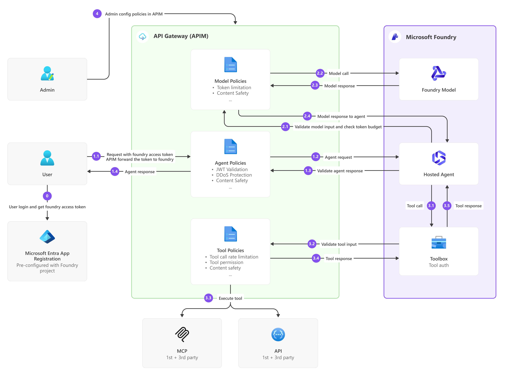

# APIM-hosted Foundry agent

This sample focuses on the API gateway pattern for enterprise AI agents. It deploys a Microsoft Foundry hosted agent with Azure API Management (APIM).
It provides:
- **Agent protection**: Uses Azure platform DDoS protection, APIM rate limiting, and Microsoft Entra token validation.
- **Model token metering and budget control**: Enforces per-platform-user tokens-per-minute and hourly token quotas.
- **Tool permission policy**: Applies governed MCP policies and optional GitHub user and tool denylists.
- **AI content safety**: Explicitly blocks harmful Responses model prompts and applies shared safety policies to agent and MCP boundaries.

## What this template is for

- Learn and review an APIM-governed Microsoft Foundry Hosted Agent architecture.
- Deploy a working agent, model gateway, and governed MCP routes through Bicep
  and azd.
- Validate Microsoft Entra authentication, managed-identity backend access, TLS
  validation, rate limits, per-user token limits, Content Safety, Prompt Shield,
  OAuth, and tool denylists.
- Provide a starting point for an adopter-specific AI gateway design.

## What this template is not for

This template is not the Prompt Agent AI gateway or bring-your-own-model (BYOM)
workflow documented by Microsoft Foundry. It does not create an admin-connected
model for a declarative Prompt Agent. It deploys a custom Python Hosted Agent
whose model and MCP traffic is governed by template-owned APIM APIs and
policies.

Review [Cost planning](docs/cost.md) before provisioning.

## Architecture



The sample includes:

- **APIM APIs:** a hosted-agent ingress API, a direct hosted-agent model API, and governed MCP tool APIs for Microsoft Learn and GitHub;
- **Agent ingress policies:** apply authentication, rate limiting, and inbound and outbound Content Safety;
- **Model gateway policies:** authenticate the hosted agent, enforce harmful-content checks and per-user token limits, and route Responses requests to Foundry with managed identity and TLS certificate chain and hostname validation;
- **Microsoft Learn MCP policies:** provide per-caller rate limiting and inbound
  and outbound harm-category filtering;
- **GitHub MCP policies:** validate GitHub OAuth, enforce user and tool denylists,
  rate-limit callers, and apply shared Content Safety checks.

## Run the agent

Run every command from the `apim-hosted-agent` directory.

### 1. Prerequisites

You need:

- [Azure CLI](https://learn.microsoft.com/cli/azure/install-azure-cli);
- [Azure Developer CLI](https://learn.microsoft.com/azure/developer/azure-developer-cli/install-azd);
- **Owner**, or both **Contributor** and **User Access Administrator**, at the
  subscription or target resource-group scope;
- **Foundry User** at the subscription scope, or on the new Foundry resource
  before deploying and invoking the agent;
- Permission and available quota to deploy and use a model in Microsoft Foundry.
  The example configuration uses `gpt-5.6-luna` version `2026-07-09` with 100
  Data Zone Standard capacity units.

Sign in to both CLIs with the same tenant:

```powershell
az login
azd auth login
```

### 2. Create an azd environment

Choose a new environment name, subscription, APIM name, and publisher details.
Use the environment name as the resource-group name.

```powershell
$environmentName = '<environment-name>'
$subscriptionId = '<subscription-id>'
$location = 'eastus'
$apimName = '<globally-unique-apim-name>'
$publisherEmail = 'you@example.com'
$publisherName = 'Your organization'

azd env new $environmentName `
  --subscription $subscriptionId `
  --location $location

azd env set AZURE_RESOURCE_GROUP $environmentName
azd env set APIM_NAME $apimName
azd env set APIM_PUBLISHER_EMAIL $publisherEmail
azd env set APIM_PUBLISHER_NAME $publisherName

azd env set GITHUB_OAUTH_CLIENT_ID '<github-oauth-client-id>'
azd env set GITHUB_OAUTH_CLIENT_SECRET '<github-oauth-client-secret>'

azd env set GITHUB_BLOCKED_USER_NAMES 'octocat,another-user' # Exact GitHub usernames, comma-separated; case-insensitive; use '' for none.
azd env set GITHUB_BLOCKED_TOOL_NAMES 'get_me,delete_file' # Exact MCP tool names, comma-separated; case-insensitive; use '' for none.

azd env select $environmentName
```

> [!DETAILS]
> **Create the GitHub OAuth App:** In **GitHub Settings > Developer settings >
> OAuth Apps**, create one app per environment. Use any valid homepage and set
> the initial callback URL to `https://localhost`. Generate a client secret,
> then use its client ID and secret in the commands above. Step 4 replaces the
> temporary callback with the connection's generated redirect URL.

### 3. Provision and deploy

```powershell
azd up --no-prompt
```

The custom `up` workflow first provisions the resource group, Foundry
account/project/model, Learn connection, RBAC, and APIM service, backends, APIs,
policies, named values, and resource links. It then deploys the toolbox and
hosted agent. When both GitHub OAuth values are configured, provisioning also
creates the GitHub APIM resources and Foundry connection. The connections are
declared in `infra/foundry.bicep`, and the postprovision hook canonicalizes
resource links.

> [!NOTE]
> To deploy without GitHub, remove the GitHub object from
> `services.tools.tools` and do not set `GITHUB_OAUTH_CLIENT_ID` or
> `GITHUB_OAUTH_CLIENT_SECRET`. With both values absent or empty, Bicep skips
> the GitHub connection and its APIM backend, API, and policy.

### 4. Configure the OAuth MCP

This sample uses GitHub as the OAuth MCP example. Bicep exports the generated
redirect URL to the selected azd environment, so retrieve it after provisioning:

```powershell
azd env get-value GITHUB_OAUTH_REDIRECT_URL
```

Replace the temporary callback in the GitHub OAuth App with this exact URL and
save the app. The callback is configuration only: do not open it directly
because it does not contain the OAuth `state` parameter.

For deployments without GitHub, skip this step.

### 5. Test the agent

Call the governed agent through APIM:

```powershell
$token = (az account get-access-token `
  --resource https://ai.azure.com/ `
  --query accessToken `
  --output tsv).Trim()

$apimName = (azd env get-value APIM_NAME).Trim()
$agentGateway = "https://$apimName.azure-api.net/agent/responses"
$body = @{
  input = 'What is Azure API Management?'
  store = $false
} | ConvertTo-Json -Compress

$body | curl.exe --request POST $agentGateway `
  --header "Authorization: Bearer $token" `
  --header 'Content-Type: application/json' `
  --data-binary '@-'
```

If the agent contains an OAuth MCP, the first request that uses it returns an
`oauth_consent_request` with a one-time consent URL. Open that URL, authorize
the OAuth app, and repeat the request. Foundry stores and injects the user's
OAuth token for subsequent tool calls.

## Customize limits

Change per-user model limits, request-rate, GitHub governance, and Content
Safety settings in **API Management > Named values**. Named-value changes affect
policy execution without changing policy XML. Rate-limit and token-limit values
are included in their counter keys, so changing a configured limit starts a
fresh counter namespace.

`azd provision --no-prompt` overwrites manual named-value changes. Update the
corresponding Bicep value before provisioning when a change must persist.

## Policy Defaults

APIM exposes exactly 13 administrator-facing named values. Deployment wiring
such as tenant ID, project managed-identity principal ID, backend ID, project
name, and model deployment name is embedded by Bicep and is not shown as policy
configuration.

| Policy XML | APIM scope and purpose | Named values (default) |
| --- | --- | --- |
| `foundry-agent-ingress-policy.xml` | Agent API: bearer-token validation and source-IP rate limiting | <ul><li>`policy-agent-rate-limit-requests` (`60`)</li><li>`policy-agent-rate-limit-window-seconds` (`60`)</li></ul> |
| `foundry-agent-content-safety-policy.xml` | Agent `/responses` operation: generic inbound safety and non-streaming outbound harm filtering | <ul><li>Five shared `policy-content-safety-*` values</li></ul> |
| `foundry-model-gateway-policy.xml` | Direct hosted-agent model API: authorize the hosted identity, apply model safety and per-user quota fragments, and select the Foundry project backend | <ul><li>`foundry-agent-principal-id` plus two user-limit values through the quota fragment</li></ul> |
| `foundry-model-content-safety-policy.xml` | Model Responses requests: Content Safety and Prompt Shield | <ul><li>Five shared `policy-content-safety-*` values</li></ul> |
| `foundry-model-user-level-policy.xml` | Validate `x-client-end-user-key` and enforce its per-user token counter | <ul><li>`policy-user-tokens-per-minute` (`100000`)</li><li>`policy-user-token-quota-per-hour` (`6000000`)</li></ul> |
| `foundry-tool-learn-mcp-policy.xml` | Microsoft Learn MCP API: per-caller rate limiting and shared Content Safety | <ul><li>`policy-tool-rate-limit-requests` (`60`)</li><li>`policy-tool-rate-limit-window-seconds` (`60`)</li><li>Four shared harm thresholds through the fragment</li></ul> |
| `foundry-tool-github-mcp-policy.xml` | GitHub MCP API: validate GitHub OAuth, apply the username/tool denylists, rate-limit by GitHub user ID, and include the shared Content Safety fragment | <ul><li>`policy-github-blocked-users` (`__none__`)</li><li>`policy-github-blocked-tools` (`__none__`)</li><li>`policy-tool-rate-limit-requests` (`60`)</li><li>`policy-tool-rate-limit-window-seconds` (`60`)</li><li>Four shared harm thresholds through the fragment</li></ul> |
| `foundry-tool-content-safety-policy.xml` | Shared MCP policy fragment: harm-category filtering | <ul><li>`policy-content-safety-hate-threshold` (`7`)</li><li>`policy-content-safety-self-harm-threshold` (`7`)</li><li>`policy-content-safety-sexual-threshold` (`7`)</li><li>`policy-content-safety-violence-threshold` (`7`)</li></ul> |

For request flow, counter keys, managed-identity trust, OAuth scopes, Content Safety behavior, and
deployment details for every policy, see [APIM Policy Reference](docs/apim-policies.md).

## Current limitations

> **Note:** APIM plans to release new capabilities for these scenarios. This
> sample will be updated when those features become available, and parts of the
> current custom implementation may be removed.

### Per-user token control uses custom middleware

The hosted agent currently uses custom middleware to derive a trusted user key
from Foundry's platform user identity and forward it to APIM for per-user token
control. A native APIM per-user token-control feature is planned for a future
release. After that capability is available, applications can use the native
feature instead of this custom middleware.

### Authorization remains in Foundry RBAC

APIM currently validates the caller's bearer token and forwards that same token
to Microsoft Foundry. It does not exchange the caller token for a new Foundry
access token or replace it with a separate downstream identity. Consequently,
access to the Foundry project and agent must still be authorized through Azure
RBAC on the Foundry resources; APIM authentication and authorization policies
alone cannot grant that downstream access. A future release is planned to
improve this identity flow so applications do not need to rely on the current
RBAC-dependent forwarding pattern.

### Custom policies are managed in API Management

The Foundry portal retains the linked APIM model API, but it does not expose
the custom agent ingress, operation-level Content Safety,
per-user quota, or MCP governance policies.
Administrators manage those policies in the standard API Management policy
experience.

## Troubleshooting

### Model deployment configuration does not match

Keep `services.project.deployments` in `azure.yaml` and `modelDeploymentName`
in `infra/apim.parameters.json` aligned.

### Provisioning fails with `InsufficientQuota`

The example model configuration requests 100 `gpt-5.6-luna` Data Zone Standard
capacity units. The failure can come from either the Foundry account-count quota
or the model quota. Inspect both in the selected environment region:

```powershell
$location = (azd env get-value AZURE_LOCATION).Trim()

az cognitiveservices usage list `
  --location $location `
  --query "[?name.value=='AIServices.S0.AccountCount' || name.value=='OpenAI.DataZoneStandard.gpt-5.6-luna'].{Quota:name.value,Current:currentValue,Limit:limit}" `
  --output table
```

If the account count is at its limit, use a region with available
`AIServices.S0.AccountCount` quota. If the model quota is insufficient, free
capacity, reduce `sku.capacity` in `azure.yaml`, or use a subscription, region,
model, and SKU with enough quota before provisioning again.

Resource-group locations are immutable. If provisioning creates the resource
group but fails for regional quota, choose another region and create a new azd
environment with a new resource-group name instead of changing
`AZURE_LOCATION` on the failed environment.

### Commands target the wrong environment

```powershell
azd env list
azd env select '<environment-name>'
azd env get-values
```

### Agent invocation returns HTTP 401

Acquire a token for `https://ai.azure.com/` and include it as a bearer token.
An ARM token is not valid for the agent ingress.

### Model calls return HTTP 401

Confirm the hosted-agent identity has **Foundry User**, the
`foundry-agent-principal-id` APIM named value matches that identity, and the
agent uses the `/ai-gateway/api/projects/<project>` endpoint. Run
`./scripts/bind-agent-identity.ps1` after reprovisioning the APIM layer.

### Model calls return HTTP 403

`Quota Exceeded` means the per-user hourly quota is consumed. The default
`policy-user-token-quota-per-hour` value is `6000000`. Changing the TPM or hourly
quota named value creates a new counter key and starts a fresh counter.
`Blocked by Content Safety` means the model harmful-content policy rejected the
prompt.

## Cleanup

```powershell
azd down
```

Review the resource group and Foundry/APIM links before confirming deletion.

## References

- [Microsoft Foundry hosted agents](https://learn.microsoft.com/azure/foundry/agents/concepts/hosted-agents)
- [Azure API Management AI gateway](https://learn.microsoft.com/azure/api-management/genai-gateway-capabilities)
- [APIM `llm-content-safety` policy](https://learn.microsoft.com/azure/api-management/llm-content-safety-policy)
- [APIM `llm-token-limit` policy](https://learn.microsoft.com/azure/api-management/llm-token-limit-policy)
- [Azure AI Content Safety](https://learn.microsoft.com/azure/ai-services/content-safety/overview)
