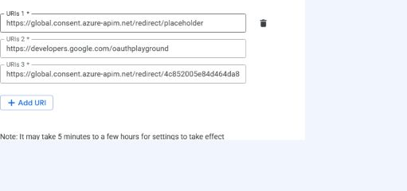

# Configure the optional Google MCP gateway

Google MCP is disabled by default. This sample assumes a separately deployed
Streamable HTTP MCP server on Google Cloud Run that accepts Google OAuth access
tokens at an HTTPS endpoint ending in `/mcp`.

Start with the [Google Cloud preparation guide](google-cloud/README.md) to
deploy the server and configure Google Auth Platform. Return here with the MCP
endpoint, OAuth client ID, and OAuth client secret.

## 1. Prepare the Google OAuth application

In Google Auth Platform:

1. Configure an Internal application, or an External application with the
   intended users added as test users.
2. Create a **Web application** OAuth client.
3. Add a temporary HTTPS redirect URI. Foundry generates the final URI only
   after the Azure connection exists.
4. Register these scopes:

   - `openid`
   - `https://www.googleapis.com/auth/userinfo.email`
   - `https://www.googleapis.com/auth/userinfo.profile`

Keep the client ID and secret outside source control. External applications in
Testing status can require re-consent when Google expires their refresh tokens.
The connection uses Google's standard authorization endpoint. Verify whether
your Foundry version requests offline access before relying on long-lived
refresh tokens in production.

## 2. Prepare the Cloud Run MCP server

Deploy the OAuth-protected MCP server and record its full `/mcp` URL. Configure
the server's `ALLOWED_CLIENT_IDS` environment variable with the same Web OAuth
client ID that will be supplied to Foundry. This audience pin is required even
though APIM also validates the access token with Google user info.

The reference server exposes `whoami`, `echo`, `add`, and `current_time`. It
must remain reachable from APIM; Cloud Run can allow unauthenticated network
access because the application itself rejects requests without a valid Google
bearer token.

## 3. Enable Google MCP in the azd environment

Run from `apim-hosted-agent`:

```powershell
azd env set GOOGLE_MCP_ENABLED 'true'
azd env set GOOGLE_MCP_ENDPOINT 'https://<cloud-run-service-host>/mcp'
azd env set GOOGLE_OAUTH_CLIENT_ID '<google-web-oauth-client-id>'
azd env set GOOGLE_OAUTH_CLIENT_SECRET '<google-web-oauth-client-secret>'
```

Optional APIM denylists accept comma-separated, case-insensitive exact values:

```powershell
azd env set GOOGLE_BLOCKED_EMAILS 'blocked-user@example.com'
azd env set GOOGLE_BLOCKED_TOOL_NAMES 'echo,current_time'
```

Set all values before adding Google to the toolbox. With incomplete values, the
IaC templates do not create the Google connection and a toolbox entry that
references `google` cannot deploy.

The committed manifests intentionally contain no Google toolbox entry. To
enable the tool, manually add the Google toolbox entry to
`services.tools.tools` in whichever `azure.yaml` is selected:

```yaml
- connection: google
  name: google
  require_approval: always
  server_label: google
  type: mcp
```

## 4. Deploy and register the callback

Choose one infrastructure path:

- **Bicep:** keep the committed `azure.yaml` active.
- **Terraform:** temporarily rename `azure.yaml` to `azure-bicep.yaml`, then
  rename `azure-terraform.yaml` to `azure.yaml`. Restore both filenames after
  deployment. Use a separate azd environment so Terraform state does not
  overlap a Bicep validation environment.

Deploy with the selected manifest:

```powershell
azd up --no-prompt
azd env get-value GOOGLE_OAUTH_REDIRECT_URL
```

Replace the temporary redirect URI in the Google Web OAuth client with the
exact exported value. Keep `ALLOWED_CLIENT_IDS` on Cloud Run equal to
`GOOGLE_OAUTH_CLIENT_ID`.



The deployment creates the following only while Google MCP is enabled:

- APIM backend `google-mcp`;
- APIM MCP API `tool-<foundry-project>-google-mcp` and its policy;
- two Google governance named values;
- Foundry custom OAuth connection `google`;
- a published toolbox version containing the manually configured `google`
  entry.

## 5. Test consent and tools

Call the hosted agent through the APIM agent endpoint and ask it to invoke a
Google tool. The first request returns an OAuth consent link. Open it, sign in
as an allowed/test user, grant consent, and continue the response flow. Verify
all four reference tools: `whoami`, `echo`, `add`, and `current_time`.

Foundry can request consent separately for the developer identity calling the
toolbox and for the hosted-agent caller context. A direct toolbox test can pass
while the hosted agent still returns `oauth_consent_request`. Open the fresh
link returned by each caller, check **I have verified this request and trust the
source**, and choose **Allow access**. A successful flow ends on a Microsoft
Foundry page headed **Authentication successful**.

Use non-personal tools for automated validation:

- `add(2, 40)` returns `42.0` directly and `42` through the hosted agent;
- `echo` returns the supplied marker;
- `current_time` returns a live timestamp.

Avoid logging `whoami` output because it contains the signed-in Google identity.

If consent reports `redirect_uri_mismatch`, compare the Google Web client URI
with `GOOGLE_OAUTH_REDIRECT_URL`. If the MCP request returns `401`, confirm the
Cloud Run audience allowlist contains the configured client ID and that the
requested scopes are registered.

## 6. Disable the integration

To stop exposing Google to the agent while retaining the provisioned Azure
resources, remove the Google toolbox block from the selected `azure.yaml` and
deploy only the toolbox:

```powershell
azd deploy tools --no-prompt
```

There is no custom cleanup script. The sample does not delete previously
deployed Google resources through imperative cleanup. Keep
`GOOGLE_MCP_ENABLED=true` and retain the OAuth
values when the Azure resources must remain. Setting the flag to false and
provisioning again invokes the selected provider's native lifecycle: Bicep can
retain earlier resources, while Terraform can destroy resources removed from
its configuration. The external Cloud Run service and Google
OAuth application are not managed by this Azure sample.
