# Configure Google OAuth

[Guide home](README.md) | [Create server](create-cloud-run-mcp.md) | **Configure OAuth** | [Troubleshooting](troubleshooting.md)

Complete this configuration in the same Google Cloud project as the Cloud Run
MCP server.

## Open Google Auth Platform

Open the [Google Cloud console](https://console.cloud.google.com/), select
`<GOOGLE_CLOUD_PROJECT_ID>`, open **Google Auth Platform > Overview**, and
choose **Get started** when the project is not configured.

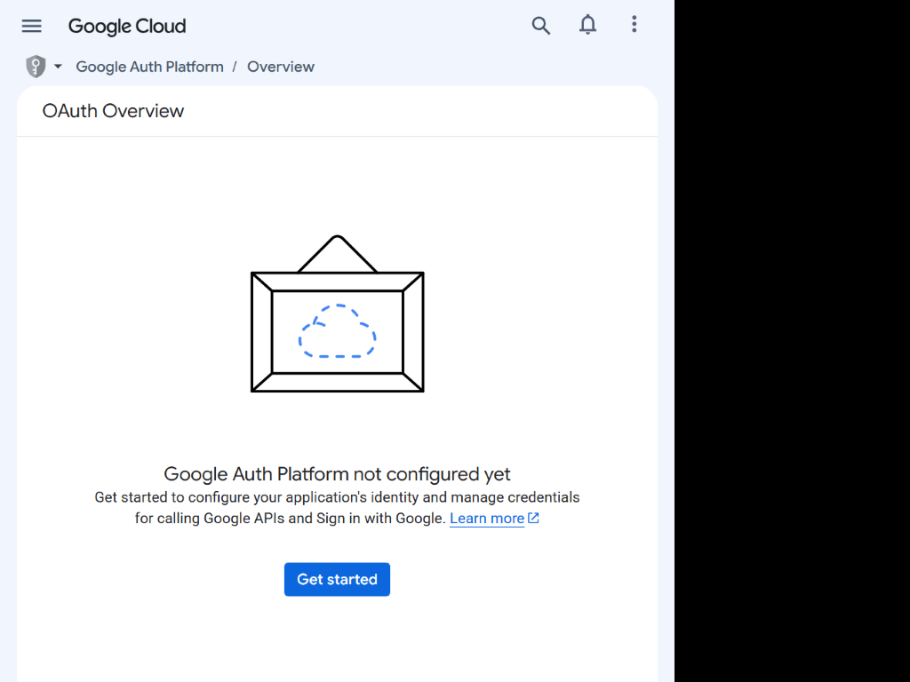

## Configure the application

Enter a recognizable app name and monitored support address.

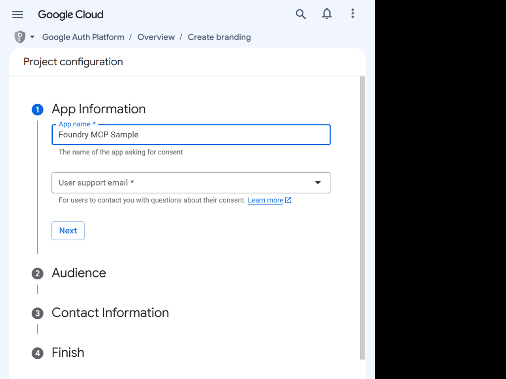

Choose **Internal** for an organization-only app when available, or **External**
for other Google accounts. External apps in Testing restrict access to test users.

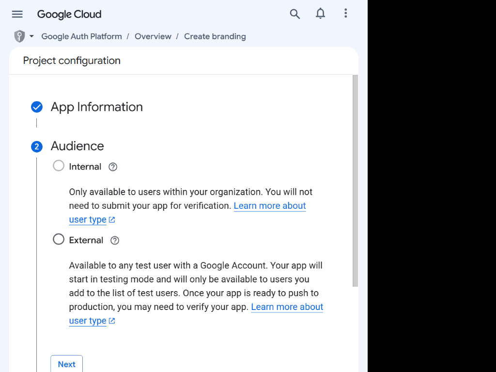

Enter a monitored developer contact address.

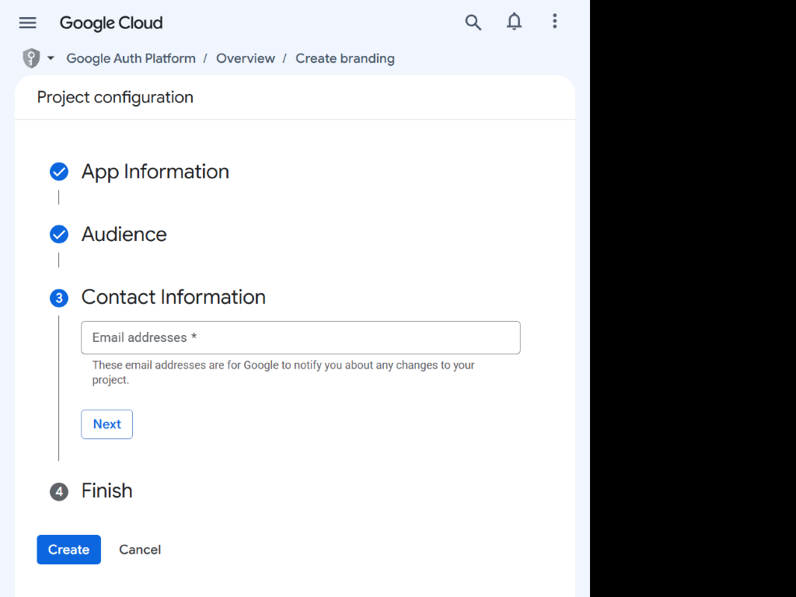

Review the Google API Services User Data Policy and create the app.

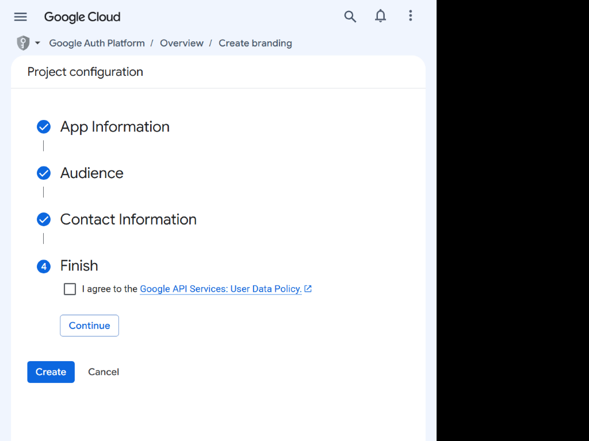

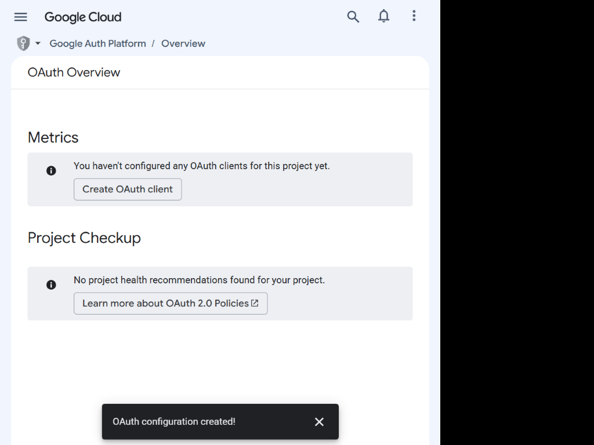

## Register identity scopes

Open **Google Auth Platform > Data access**, choose **Add or remove scopes**, and
select:

```text
openid
https://www.googleapis.com/auth/userinfo.email
https://www.googleapis.com/auth/userinfo.profile
```

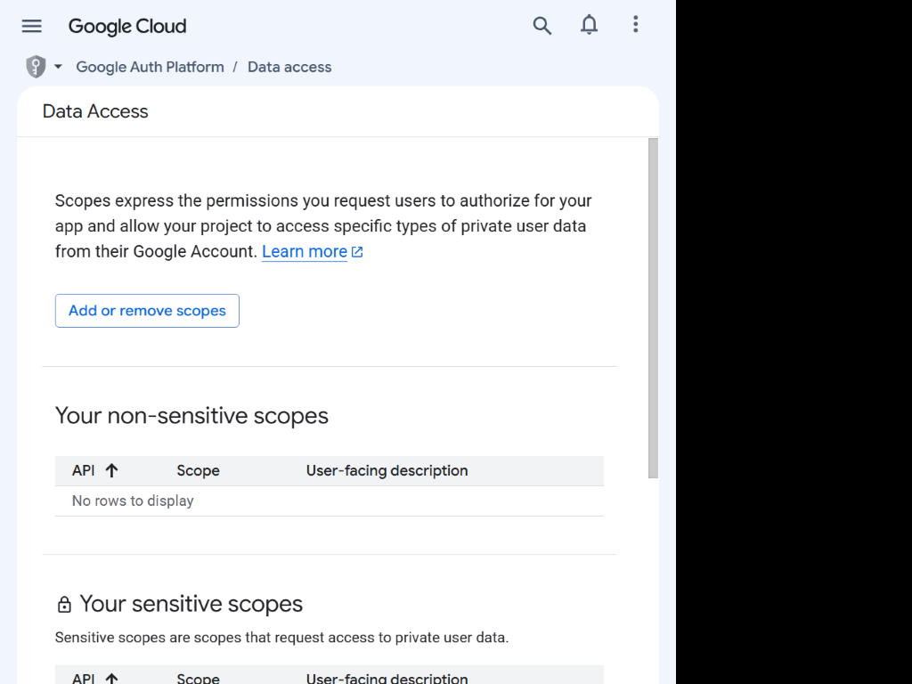

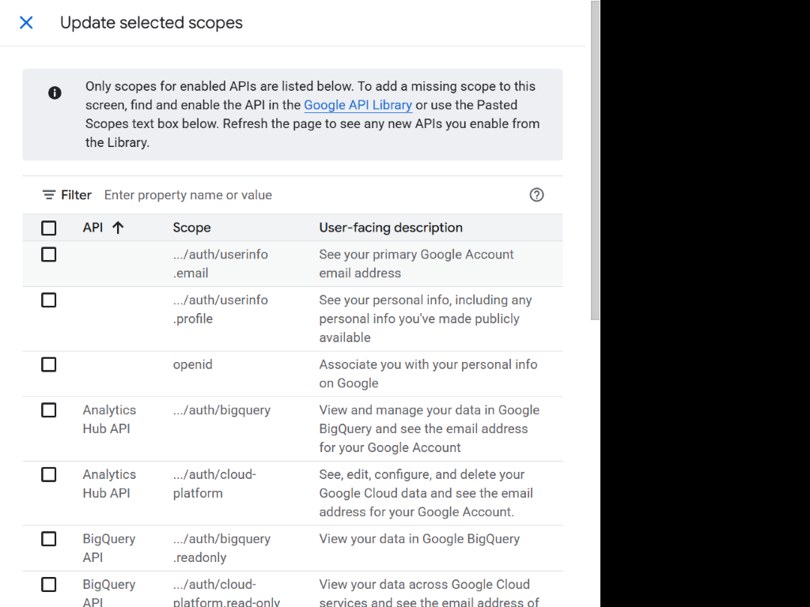

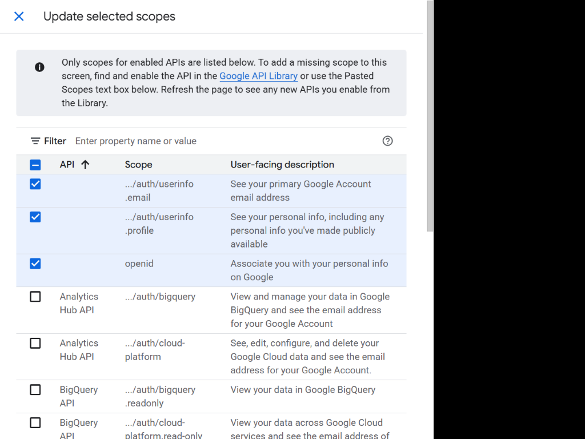

Confirm the scopes appear under non-sensitive scopes.

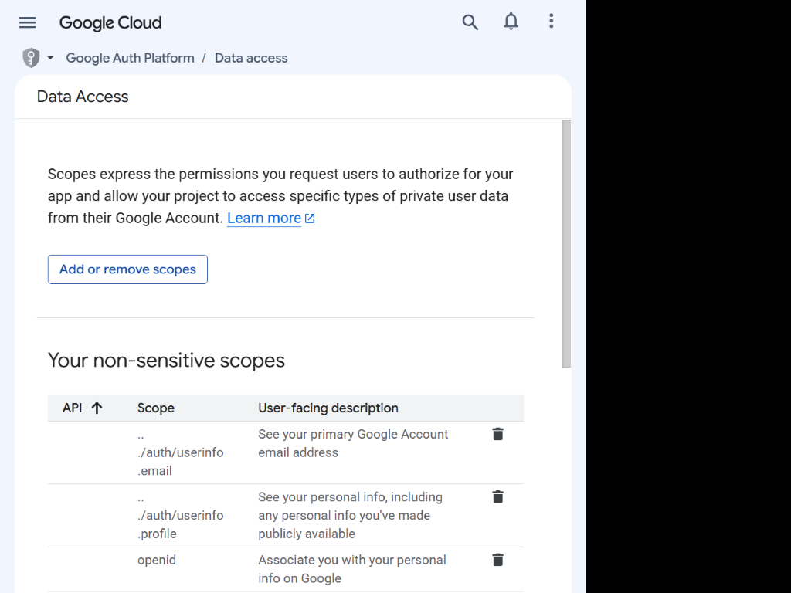

Add only scopes required by the MCP tools.

## Add test users when required

For an External app in Testing, open **Audience > Test users** and add every
account that will test the connection. Skip this for an Internal app or a
published app without the test-user restriction.

## Create the Web application client

Obtain the exact `<OAUTH_REDIRECT_URI>` from the consuming application. Open
**Google Auth Platform > Clients**, choose **Create client**, and select **Web application**.

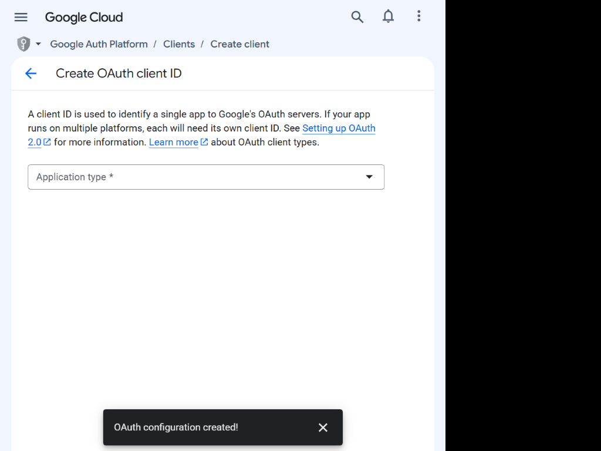

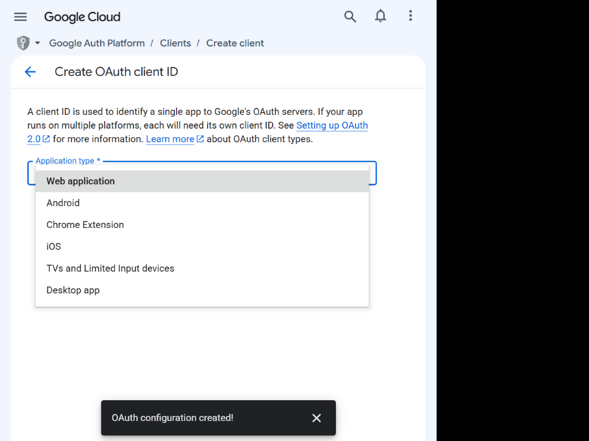

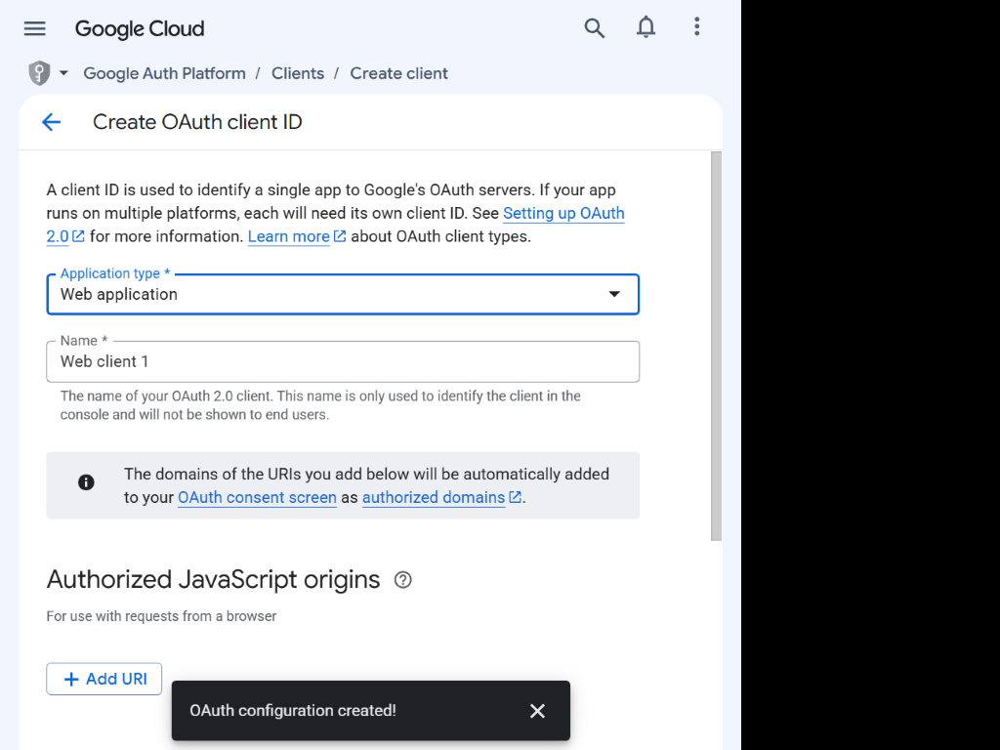

Enter a descriptive name. Leave Authorized JavaScript origins empty unless a
browser app requires one. Under **Authorized redirect URIs**, add
`<OAUTH_REDIRECT_URI>` exactly.

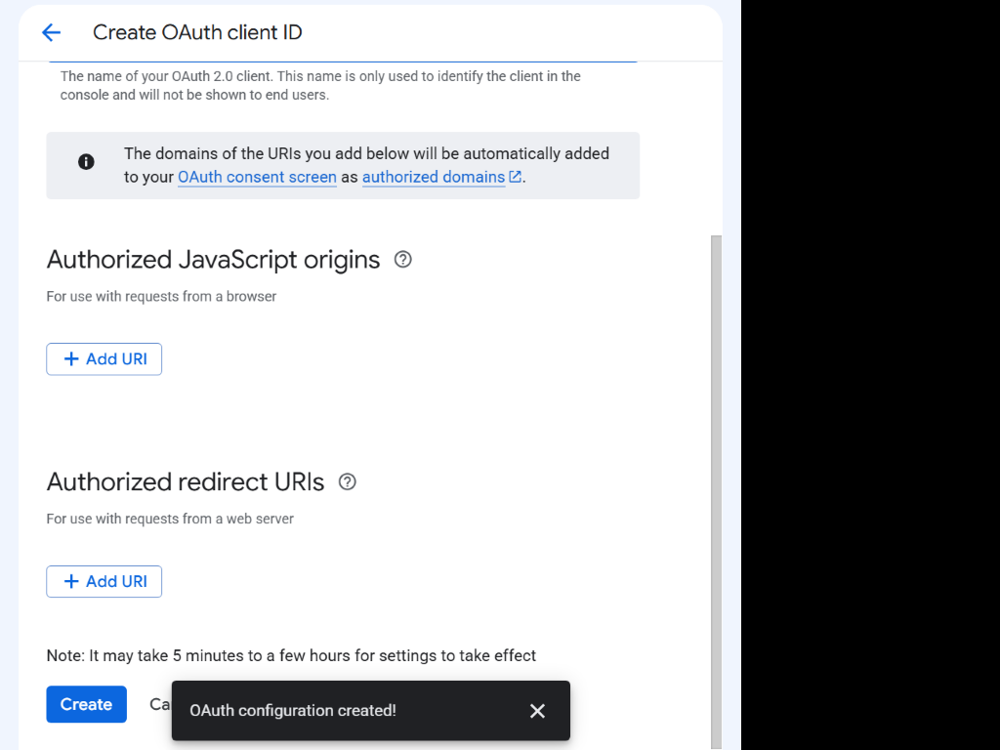

Create the client and immediately store its ID and secret in an approved secret
store. Never place secrets in documentation, logs, tickets, or source control.

## Verify the server audience

Set `ALLOWED_CLIENT_IDS=<GOOGLE_OAUTH_CLIENT_ID>` on Cloud Run and deploy a new
revision if required. Verify missing and wrong-audience tokens return `401`,
while a token issued for the configured client is accepted.

## Checkpoint

- `<MCP_ENDPOINT>` is recorded.
- `<OAUTH_REDIRECT_URI>` is registered exactly.
- Client ID and secret are stored securely.
- Identity scopes and required test users are configured.
- Cloud Run audience pinning is enabled.

Return to the [integration guide](../README.md).
