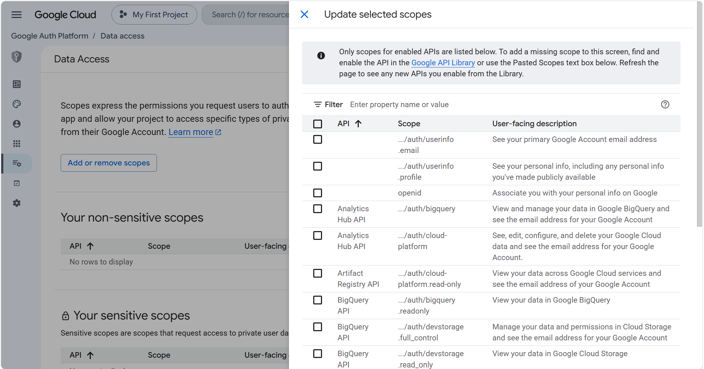
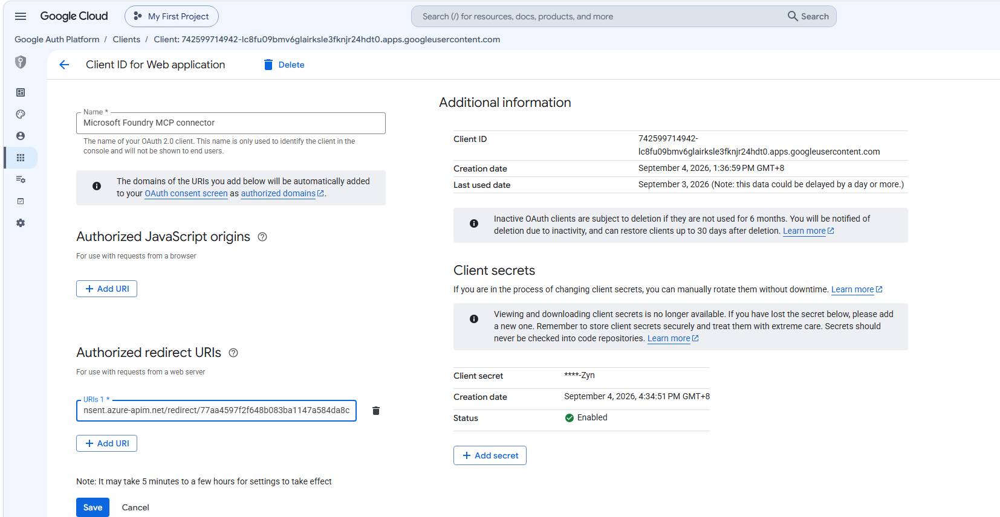

# Configure Google OAuth for the Foundry Google MCP connection

[Azure APIM and Foundry guide](README.md)

The OAuth client ID is needed before the external MCP server can validate token
audiences, but Foundry generates its final callback only after Azure
provisioning. Configure OAuth in two stages.

## Stage A: create the OAuth client

1. Open [Google Auth Platform](https://console.cloud.google.com/auth/overview)
   in the Google Cloud project that hosts the MCP server.
2. Create the application. Choose **Internal** when it is organization-only, or
   **External** for other Google accounts.
3. For an External application in Testing, add every intended tester under
   **Audience > Test users**.
4. Under **Data access**, register:

   ```text
   openid
   https://www.googleapis.com/auth/userinfo.email
   https://www.googleapis.com/auth/userinfo.profile
   ```

   

5. Under **Clients**, create a **Web application** client.
6. Add a temporary URI under **Authorized redirect URIs**.

   

7. Store the client ID and secret securely. Never place the secret in source
   control, documentation, screenshots, logs, or tickets.
8. Configure the external MCP server with:

   ```text
   ALLOWED_CLIENT_IDS=<GOOGLE_OAUTH_CLIENT_ID>
   ```

Use Google's official documentation to deploy and verify the server:

- [Host MCP servers on Cloud Run](https://docs.cloud.google.com/run/docs/host-mcp-servers)
- [Build and deploy a Python service to Cloud Run](https://docs.cloud.google.com/run/docs/quickstarts/build-and-deploy/deploy-python-service)

An unauthenticated application-level MCP request should return `401`.

The template requests only the three identity scopes above. If a deployed tool
needs another Google API, enable that API and update both the Google Data Access
configuration and the Bicep/Terraform Foundry connection scopes.

Return to the [Azure guide](README.md) to provision APIM and Foundry.

## Stage B: add the Foundry callback

After `azd provision` exports `GOOGLE_OAUTH_REDIRECT_URL`:

1. Open the same Web client.
2. Add the exact `GOOGLE_OAUTH_REDIRECT_URL` under
   **Authorized redirect URIs**.
3. Save the client and complete Foundry authorization.
4. Remove the temporary redirect URI after validation succeeds.

Google requires an exact match, including scheme, host, path, case, and trailing
slash. Never copy a callback from another environment.

Return to the [Azure deployment step](README.md#3-deploy).

## Common OAuth issues

| Symptom | Resolution |
| --- | --- |
| `redirect_uri_mismatch` | Compare the configured URI with the Foundry output character by character |
| `Access blocked` | Add the account under **Audience > Test users** |
| `invalid_scope` | Enable the required API and copy the exact scope from Data Access |
| Consent URL returns 404 | Generate a new request; consent URLs are short-lived and single-use |
| `Code ... not found` | Discard the consumed/expired URL and generate another |
| Browser succeeds but consent repeats | Confirm the environment and whether the caller is hosted or direct Toolbox |
| MCP returns `401` after OAuth | Confirm Foundry and the server use the same client ID |
