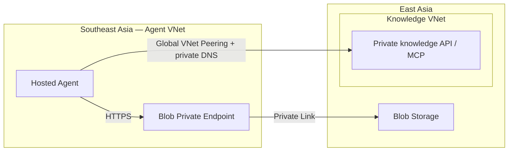

# Cross-region Hosted Agent connectivity — draft

**DRAFT — for current reference only, not a production-ready template.**

Minimal Bicep infrastructure for connecting a Hosted Agent in Southeast Asia to existing data and knowledge services in East Asia. It adds connectivity to existing resources in the same subscription; it does not deploy the Agent, model or knowledge backend.

## Validated patterns

**Test date: 9/28.** Infrastructure deployment, repeat deployment and actual Hosted Agent calls passed.

| Pattern | Infrastructure | Result |
|---|---|---|
| Southeast Asia Hosted Agent → East Asia Blob Storage | Private Endpoint, private DNS zone group and container-scoped Blob Data Reader | 2/2 calls passed |
| Southeast Asia Hosted Agent → East Asia private knowledge API/MCP | Bidirectional Global VNet Peering with existing private DNS | REST API and agent-executed MCP each passed 2/2 calls |

The knowledge backend was hosted on internal Azure Container Apps. Customer AKS ingress and authentication require integration testing. This draft covers agent-executed API/MCP calls, not platform-managed MCP configuration.

## Architecture



Existing private DNS resolves both service endpoints from the Agent VNet. Returned content crosses into Southeast Asia for processing.

## Quick start

1. Prepare the Southeast Asia Hosted Agent/VNet and East Asia Blob container or private HTTPS API/MCP service. Use non-overlapping VNet address spaces and a separate Private Endpoint subnet.
2. Ensure the existing Blob private DNS zone is linked to the Agent VNet, and the knowledge hostname resolves privately from it. Peering does not configure DNS automatically. Obtain the deployed **Agent instance principal ID** and permissions to create endpoints, peerings and role assignments.
3. From this directory, copy `infra/example.parameters.json` to `infra/customer.parameters.local.json` and replace the placeholders. Set `enableStorage` or `enableKnowledge` to `false` to omit a pattern.
4. Preview and deploy into the resource group containing the Southeast Asia Agent VNet:

```powershell
az deployment group what-if --subscription <subscription-id> --resource-group <agent-resource-group> --template-file infra/main.bicep --parameters @infra/customer.parameters.local.json
az deployment group create --subscription <subscription-id> --resource-group <agent-resource-group> --name cross-region-connectivity --template-file infra/main.bicep --parameters @infra/customer.parameters.local.json
```

Approve the Storage private endpoint if its connection is pending. Then use the Hosted Agent to read a Blob or call the private knowledge endpoint.

## References

- [Private-network Hosted Agent](https://github.com/microsoft/Foundry-Agent-Solution-Templates/tree/main/private-network-hosted-agent): Net isolation, Private Endpoints, peering, restricted egress, managed identity/RBAC, and Foundry/Search CMK configuration. CMK is not implemented by this draft.
- [APIM-hosted Agent](https://github.com/microsoft/Foundry-Agent-Solution-Templates/tree/main/apim-hosted-agent): API/MCP authentication, rate limiting and tool-access policies. APIM can sit between the agent and Knowledge Base to govern those calls; private networking must be configured for the selected APIM tier.
- [Foundry private networking](https://learn.microsoft.com/en-us/azure/foundry/agents/how-to/virtual-networks) and [VNet peering](https://learn.microsoft.com/en-us/azure/virtual-network/virtual-network-peering-overview).

Source data stays in East Asia, but retrieved content crosses into Southeast Asia for Agent/model processing.
