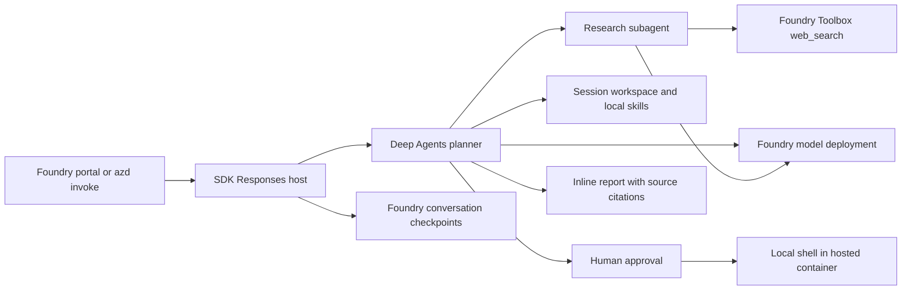

# Deep Agents on Microsoft Foundry

A research assistant adapted from the upstream Deep Research example. Deep
Agents plans, delegates to a research subagent, uses tools and working files, and returns a
cited report. The model runs in Foundry; `langchain-azure-ai` supplies the model
wrapper and Responses host. Research uses Foundry Toolbox managed `web_search`.
A bundled skill also analyzes a fictional sales dataset with Python, pausing
for approval before shell execution. No Tavily key is required; Foundry web
search usage can incur charges.

The SDK's [configuration-driven runner](https://docs.langchain.com/oss/python/integrations/providers/microsoft#use-the-configuration-driven-runner)
loads `create_graph` from `src/main.py` through `src/langgraph.json`. Agent code
only constructs the graph; local and hosted startup commands select the
Responses server without a custom server entry point.

Researchers call `think_tool` after each search to summarize evidence, gaps and
whether to narrow the next query or stop. The tool records a concise progress
assessment; it does not search, validate sources or call a separate model.
Simple questions have a prompt budget of 2-3 searches per researcher, complex
questions up to 5, with earlier stopping when evidence is sufficient or two
successive searches add no new information. The coordinator defaults to one
researcher, permits up to three in parallel for independent aspects, and uses
at most three delegation rounds. These are model instructions, not code-enforced
quotas. The final report consolidates numbered citations and checks coverage
against the saved request.

## What this template is for

- Learn how to host a LangChain/LangGraph Deep Agents workflow on Foundry.
- Deploy a research agent with planning, subagent delegation, tool calls and
  report generation using a Foundry model.
- Research public sources with Foundry managed web search and source citations.
- Load local skills, run approved Python analysis and continue a conversation
  using Foundry checkpoints and a Hosted Agent session workspace.
- Use the template as a starting point for your own research tools and prompts.

## What this template is not for

This template is not a complete production architecture or a guarantee that
every research claim is correct. The bundled sales dataset is fictional. It
does not provide long-term memory or a shell security sandbox.

[Cost planning](docs/cost.md) is pending; deployment and usage incur Azure charges.

## Architecture



The native `microsoft.foundry` azd provider provisions the Foundry resources
required for a project, the declared `gpt-4.1-mini` model deployment and the
Hosted Agent. The native Toolbox service deploys `deep-agents-tools`, containing
only managed `web_search`; the SDK loads that tool for the research subagent.
You supply an Azure subscription, a supported region with model
quota, and an identity allowed to provision resources and role assignments.
The hosted runtime uses managed identity; local model calls use
`DefaultAzureCredential`. No API keys belong in source control.

`LocalShellBackend` uses `$HOME/deep-agents` in the Hosted Agent session.
Foundry persists HOME across session idle/resume; files belong to the session,
so conversations in the same session share them. A new session starts a
separate workspace. See [Hosted session storage](https://learn.microsoft.com/azure/foundry/agents/how-to/manage-hosted-sessions).
Locally, the ignored `.workspace` directory is shared by all requests to that
development server; it is not a multi-user host. Bundled skills/data are seeded
only when absent, so restarts preserve edits and generated reports.

`FoundryCheckpointSaver` persists conversation state and pending approvals,
with user isolation enabled. The runner enables native background recovery.
Checkpoints are separate from workspace files and long-term memory. Local
development uses the SDK's file-backed state store; hosted runs use Foundry
storage. File tools use virtual workspace paths. Shell commands run with the
workspace as their current directory, **but can access the rest of the container**.
Only basic executable-path/Windows variables are passed to the shell; credentials
are not inherited. This does not prevent approved code from accessing host
files, network or managed identity. Review every command and use trusted users
and synthetic data. A native `CompositeBackend` routes all file tools to a
filesystem backend, with ordered permissions: allow writes under `/work/**`,
then deny writes under `/**`. Both the coordinator and research subagents can
read the workspace, but can create or modify files only under `/work/`. All
other paths, including `/skills/`, `/data/` and new directories, are read-only
through file tools. Reports, scripts and context-offload artifacts use `/work/`.
These are file-tool permissions, not OS read-only mounts: approved shell code
can still modify those files. Review script contents as well as the command.

## Run the agent

Run every command from the `deep-agents` directory.

### 1. Prerequisites

- Azure CLI
- Azure Developer CLI (`azd`) 1.32 or newer
- The `azure.ai.agents` extension beta.9 or newer, `azure.ai.toolboxes` beta.5
  or newer, and the native
  `microsoft.foundry` infrastructure provider
- Python 3.13 with pip for local development and tests
- An Azure subscription, a supported region with model quota, and permission
  to create resources and role assignments

Sign in and install the required extensions:

```powershell
az login
azd auth login
azd extension install azure.ai.agents
azd extension install azure.ai.toolboxes
azd extension install microsoft.foundry
```

### 2. Provision and deploy

```powershell
azd env new deep-agents-demo
azd up
```

Select a supported subscription and region when prompted. `azure.yaml` pins
the model name, version, SKU and capacity; change its deployment block before
provisioning if your region or quota requires a different tool-capable model.
The native provider supplies `FOUNDRY_PROJECT_ENDPOINT`. Both the declared model
deployment name and the agent's `AZURE_AI_MODEL_DEPLOYMENT_NAME` default to
`gpt-4.1-mini`, so a new environment needs no model-name setting. To use another
deployment name, set `AZURE_AI_MODEL_DEPLOYMENT_NAME` in the azd environment;
when provisioning a different model, also update the model/version/SKU fields.
`TOOLBOX_NAME` selects the declared `deep-agents-tools` toolbox. For an existing
deployment, run `azd deploy deep-agents-tools` before `azd deploy deep-agents`.
Toolbox deployments create immutable versions. The adapter resolves the
toolbox's published default; after changing its definition, inspect
`azd ai toolbox versions list deep-agents-tools` and publish the intended version
with `azd ai toolbox publish deep-agents-tools <version>`, then redeploy the
agent to reload its tools.

### 3. Test the agent

```powershell
azd ai agent invoke deep-agents --new-session --new-conversation --protocol responses "Research how Microsoft Foundry hosted agents handle session storage. Use official documentation, plan the work, delegate research, save and read the final report, and return the report inline with source URLs."
```

The same prompt can be used in the deployed agent's Foundry playground.
When testing a newly deployed version, add `--version <version>` and start a
new session and conversation; existing sessions remain bound to their version.
Expect a cited report generated through research delegation and managed web
search. For detailed checks, research-strategy cases, execution approval,
session continuity and offline test coverage, see [Validation](docs/validation.md).

Shell analysis requires explicit approval. Follow the documented
[REST approval procedure](docs/validation.md#analysis-and-execution-approval).

## Local development

Create a virtual environment using Python 3.13 (the deployed runtime) and
install the pinned direct dependencies:

```powershell
py -3.13 -m venv .venv
.venv/Scripts/python -m pip install -r src/requirements.txt
.venv/Scripts/python -m unittest discover -s tests -v
```

On Linux/macOS use `python3.13` and `.venv/bin/python`. Tests make no Azure
calls; see [Offline tests](docs/validation.md#offline-tests) for coverage and
limitations.

After `az login`, set `FOUNDRY_PROJECT_ENDPOINT` and
`AZURE_AI_MODEL_DEPLOYMENT_NAME` in your shell to your own project's values,
and `TOOLBOX_NAME` to `deep-agents-tools` (or your existing toolbox exposing
`web_search`). Deploy the toolbox before starting the local agent.
Set local content-recording controls and keep SDK state inside the ignored
template directory before starting either local host:

```powershell
$env:OTEL_INSTRUMENTATION_GENAI_CAPTURE_MESSAGE_CONTENT = 'false'
$env:AZURE_TRACING_GEN_AI_CONTENT_RECORDING_ENABLED = 'false'
$env:LANGSMITH_TRACING = 'false'
$env:AGENTSERVER_STATE_ROOT = Join-Path (Get-Location) '.agentserver'
```

For the azd development workflow, run `azd ai agent run deep-agents` from this
directory; it installs dependencies and starts the host and Agent Inspector.
Use the Inspector to send the verification prompt and inspect tool activity.
Alternatively, with the dependencies installed, run the SDK runner directly
from this directory:

```powershell
.venv/Scripts/python -m langchain_azure_ai.agents.hosting.run --config src/langgraph.json --protocol responses --option resilient_background=true --host 127.0.0.1
```

The graph factory reads shell variables; it does not load a `.env` file. In
another terminal you can invoke either host:

```powershell
azd ai agent invoke deep-agents --local --protocol responses "Research Microsoft Foundry hosted agent session storage using official documentation. Return the full report inline with source URLs."
```

Local model and web search calls are billable. Do not expose the local development host to
untrusted networks. The hosting SDK automatically initializes OpenTelemetry
and uses the runtime's telemetry configuration; Foundry also emits service-side
invocation traces. No custom exporter is configured by this template. See
[Hosted agent tracing](https://learn.microsoft.com/azure/foundry/observability/quickstarts/quickstart-tracing-hosted-agent).
The deployment disables LangSmith tracing and message-content recording, not
tracing itself. These settings do not disable Foundry conversation history or
override service retention policies.
Do not also initialize a `TracerProvider` or call `enable_auto_tracing()` in the
graph factory: the configuration-driven runner already initializes the hosting
SDK's telemetry. A second setup can conflict with the global provider or emit
duplicate spans. Configure the hosting SDK's supported environment settings
for the desired destination; standalone examples that own their exporter setup
have a different initialization lifecycle.

## Customize

- Customize the coordinator and researcher instructions in `src/agent.py`.
- Change the declared Toolbox in `azure.yaml` to configure managed search.
  The graph deliberately selects only `web_search`; adding other tools to the
  Toolbox does not automatically expose them to the agent.
- Configure the model deployment in `azure.yaml` before provisioning.
- Add skill directories under `src/skills` and synthetic inputs under `src/data`.
  Existing session copies are preserved; use a new session to pick up changed
  bundled files. Keep shell approval enabled for all subagents.

## Troubleshooting

- Authentication or authorization failures: check the selected Azure identity
  and its Foundry project/model access. Do not add keys to fix a role issue.
- Model deployment failures: check the region, model version, SKU and quota
  in `azure.yaml`; retry with a supported deployment configuration.
- Toolbox startup failures: verify `TOOLBOX_NAME`, the published version,
  `web_search` availability and the caller's Toolbox access. The graph fails
  startup if search is missing; it never silently falls back to fictional data.
- Search failures: inspect Toolbox tool output and region/service availability.
  A completed response alone does not prove that a search succeeded.
- Missing extensions: update azd and install the required extensions.
- Incomplete workflow: inspect `azd ai agent monitor` output and the tool
  activity; keep logs local and redact identities and resource IDs before sharing.

## Cleanup

```powershell
azd down
```

Review the resource deletion prompt; remove only this environment's resources.
Local `.azure`, `.env`,
virtual environments, `.workspace`, SDK state and logs are ignored by Git. Never paste their contents
into a public issue or commit.

## License and attribution

This template is licensed under the repository [MIT License](../LICENSE). See
[Attribution](ATTRIBUTION.md) for adapted examples and upstream license notices.
