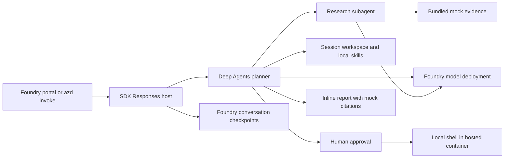

# Deep Agents on Microsoft Foundry

A research assistant adapted from the upstream Deep Research example. Deep
Agents plans, delegates to a research subagent, uses tools and working files, and returns a
cited report. The model runs in Foundry; `langchain-azure-ai` supplies the model
wrapper and Responses host. Search uses bundled, clearly labeled fictional
evidence. A bundled skill also analyzes a fictional sales dataset with Python,
pausing for approval before shell execution. No Tavily key or other search
subscription is required.

The SDK's [configuration-driven runner](https://docs.langchain.com/oss/python/integrations/providers/microsoft#use-the-configuration-driven-runner)
loads `create_graph` from `src/main.py` through `src/langgraph.json`. Agent code
only constructs the graph; local and hosted startup commands select the
Responses server without a custom server entry point.

## What this template is for

- Learn how to host a LangChain/LangGraph Deep Agents workflow on Foundry.
- Deploy a research agent with planning, subagent delegation, tool calls and
  report generation using a Foundry model.
- Explore the workflow with bundled fictional evidence and no external search
  API key.
- Load local skills, run approved Python analysis and continue a conversation
  using Foundry checkpoints and a Hosted Agent session workspace.
- Use the template as a starting point for your own research tools and prompts.

## What this template is not for

This template is not a live web research service or a complete production
architecture. The fixture products, prices and URLs are fictional. It does not
provide live evidence, long-term memory or a shell security sandbox.

Review [Cost planning](docs/cost.md) before provisioning.

## Architecture



The native `microsoft.foundry` azd provider provisions the Foundry resources
required for a project, the declared `gpt-4.1-mini` model deployment and the
Hosted Agent. You supply an Azure subscription, a supported region with model
quota, and an identity allowed to provision resources and role assignments.
The hosted runtime uses managed identity; local model calls use
`DefaultAzureCredential`. No API keys belong in source control.

`LocalShellBackend` uses `$HOME/deep-agents` in the Hosted Agent session.
Foundry persists HOME across session idle/resume; files belong to the session,
so conversations in the same session share them. A new session starts a
separate workspace. See [Hosted session storage](https://learn.microsoft.com/azure/foundry/agents/how-to/manage-hosted-sessions).
Locally, the ignored `.workspace` directory is shared by all requests to that
development server; it is not a multi-user host. Bundled skills/data are seeded
only when absent, so restarts preserve edits and generated reports.

`FoundryCheckpointSaver` persists conversation state and pending approvals,
with user isolation enabled. The runner enables native background recovery.
Checkpoints are separate from workspace files and long-term memory. Local
development uses the SDK's file-backed state store; hosted runs use Foundry
storage. File tools use virtual workspace paths. Shell commands run with the
workspace as their current directory, **but can access the rest of the container**.
Only basic executable-path/Windows variables are passed to the shell; credentials
are not inherited. This does not prevent approved code from accessing host
files, network or managed identity. Review every command and use trusted users
and synthetic data. Skills/data are not enforced read-only.

## Run the agent

Run every command from the `deep-agents` directory.

### 1. Prerequisites

- Azure CLI
- Azure Developer CLI (`azd`) 1.32 or newer
- The `azure.ai.agents` extension beta.9 or newer and the native
  `microsoft.foundry` infrastructure provider
- Python 3.13 with pip for local development and tests
- An Azure subscription, a supported region with model quota, and permission
  to create resources and role assignments

Sign in and install the required extensions:

```powershell
az login
azd auth login
azd extension install azure.ai.agents
azd extension install microsoft.foundry
```

### 2. Provision and deploy

```powershell
azd env new deep-agents-demo
azd up
```

Select a supported subscription and region when prompted. `azure.yaml` pins
the model name, version, SKU and capacity; change its deployment block before
provisioning if your region or quota requires a different tool-capable model.
The native provider supplies `FOUNDRY_PROJECT_ENDPOINT` and resolves the model
deployment environment variable for the hosted service.

### 3. Test the agent

```powershell
azd ai agent invoke deep-agents --new-session --new-conversation --protocol responses "Compare the fictional Cedar and Maple document processing services using the bundled mock evidence. Plan the work, delegate research, save and read the final report, and return the report inline."
```

The same prompt can be used in the deployed agent's Foundry playground.
When testing a newly deployed version, add `--version <version>` and start a
new session and conversation; existing sessions remain bound to their version.
Verify the following:

- The run completes through the Responses endpoint. Tool activity shows
  `write_todos`, `task`, `mock_search`, `write_file` and `read_file`.
- The inline report is labeled MOCK / FICTIONAL TEST DATA, compares Cedar and
  Maple, and cites only the bundled `https://example.com/mock/` identifiers.
- The reported fixture facts are accurate: 12 vs 18 credits per 1,000 pages,
  80 vs 120 pages/minute and 7 vs 1 days retention.
- A request about an unsupported real-world topic reports the evidence gap,
  without pretending to search the web or presenting fixtures as real facts.

Agent behavior is model-driven; inspect tool activity as well as final prose.
Offline tests do not verify Azure connectivity or model-generated results.
After source changes, use `azd deploy` and repeat the same verification prompt.

### 4. Verify analysis, approval and continuity

Ask: "Use the dataset-analysis skill to analyze the bundled fictional sales.
Run the calculation with Python after approval, then save and return a report."
Verify `read_file` loads the skill, `write_file` creates the script and `execute`
pauses before running. Approve only the expected local calculation. The totals
are Cedar: revenue 300, cost 180, profit 120; Maple: 360, 240, 120; combined:
660, 420, 240 fictional credits. Reject a separate execution and verify that
the command does not run. Approval also applies to delegated subagents.

The pinned SDK accepts LangChain's structured resume through the Responses API:
send a `function_call_output` using the pending approval's call ID, in the same
session and conversation. Its `output` is the JSON string
`{"resume":{"decisions":[{"type":"approve"}]}}` (or `reject`).
`azd ai agent invoke --input-file` sends file content as a text message, not a
structured Responses payload. Inspector's simple approve/reject buttons emit
`mcp_approval_response`, which the pinned adapter does not translate to
LangChain decisions. Use native PowerShell REST for the single-command demo
below. Supply the pending response and session IDs from your own invocation;
inspect the command before choosing a decision. Do not share tokens or output
containing resource identifiers.

```powershell
$responseId = '<pending-response-id>'
$sessionId = '<same-agent-session-id>'
$agent = azd ai agent show deep-agents -o json | ConvertFrom-Json
$pending = azd ai agent invocations show -n deep-agents --protocol responses --id $responseId -o json | ConvertFrom-Json
$calls = @($pending.output | Where-Object { $_.type -eq 'function_call' -and $_.name -eq '__hosted_agent_adapter_interrupt__' })
if ($calls.Count -ne 1 -or -not $pending.conversation.id) { throw 'Expected one pending interrupt and a conversation ID.' }
$actions = @(($calls[0].arguments | ConvertFrom-Json).value.action_requests)
if ($actions.Count -ne 1 -or $actions[0].name -ne 'execute') { throw 'This example handles one execute action only.' }
$actions[0] | ConvertTo-Json -Depth 10
$decision = Read-Host 'Review the command above, then enter approve or reject'
if ($decision -notin @('approve', 'reject')) { throw 'No decision submitted.' }
$resume = @{ resume = @{ decisions = @(@{ type = $decision }) } } | ConvertTo-Json -Depth 10 -Compress
$body = @{
    conversation = @{ id = $pending.conversation.id }
    agent_session_id = $sessionId
    input = @(@{ type = 'function_call_output'; call_id = $calls[0].call_id; output = $resume })
    stream = $false
    store = $true
} | ConvertTo-Json -Depth 10
$token = az account get-access-token --resource https://ai.azure.com/ --query accessToken -o tsv
$result = Invoke-RestMethod -Method Post -Uri $agent.agent_endpoints.responses -Headers @{ Authorization = "Bearer $token" } -ContentType 'application/json' -Body $body
$result.output
```

In the same conversation, ask to read `/analysis_report.md` and explain a total.
Repeat after the session idles/resumes: both the file and conversation should
remain available. A different conversation in that session shares files but
not checkpointed messages; a new session should not contain the old report.
Recovery resumes the saved graph state, but arbitrary shell side effects are
not transactional or guaranteed to execute exactly once.
Automatic in-flight recovery additionally requires a stored background
response (`background=true`, `store=true`); ordinary foreground requests do not
enable that path. A persisted approval can be resumed after restarting its
session with the structured request above. Session files can be downloaded
with `azd ai agent files download deep-agents/analysis_report.md` using the
same session ID.

Deep Agents automatically offloads large tool results to `/large_tool_results/`
and archives summarized history under `/conversation_history/`. Offline tests
exercise both using synthetic output and a reduced summarization threshold.
Production keeps the native model-aware thresholds; a short demo should not
be expected to trigger summarization.

## Local development

Create a virtual environment using Python 3.13 (the deployed runtime) and
install the pinned direct dependencies:

```powershell
py -3.13 -m venv .venv
.venv/Scripts/python -m pip install -r src/requirements.txt
.venv/Scripts/python -m unittest discover -s tests -v
```

On Linux/macOS use `python3.13` and `.venv/bin/python`. This check drives the
real graph with a scripted model through planning, delegation, mock tool use,
file writing/reading, report completion, approved/rejected execution (including
subagents), saved-approval reload with the SDK's local persistent state store,
conversation isolation, output offloading and history summarization. It makes
no Azure calls and does not verify cloud restart recovery.

After `az login`, set `FOUNDRY_PROJECT_ENDPOINT` and
`AZURE_AI_MODEL_DEPLOYMENT_NAME` in your shell to your own project's values.
Set local content-recording controls and keep SDK state inside the ignored
template directory before starting either local host:

```powershell
$env:OTEL_INSTRUMENTATION_GENAI_CAPTURE_MESSAGE_CONTENT = 'false'
$env:AZURE_TRACING_GEN_AI_CONTENT_RECORDING_ENABLED = 'false'
$env:LANGSMITH_TRACING = 'false'
$env:AGENTSERVER_STATE_ROOT = Join-Path (Get-Location) '.agentserver'
```

For the azd development workflow, run `azd ai agent run deep-agents` from this
directory; it installs dependencies and starts the host and Agent Inspector.
Use the Inspector to send the verification prompt and inspect tool activity.
Alternatively, with the dependencies installed, run the SDK runner directly
from this directory:

```powershell
.venv/Scripts/python -m langchain_azure_ai.agents.hosting.run --config src/langgraph.json --protocol responses --option resilient_background=true --host 127.0.0.1
```

The graph factory reads shell variables; it does not load a `.env` file. In
another terminal you can invoke either host:

```powershell
azd ai agent invoke deep-agents --local --protocol responses "Compare Cedar and Maple using the mock evidence. Return the full report inline."
```

Local model calls are billable. Do not expose the local development host to
untrusted networks. The hosting SDK automatically initializes OpenTelemetry
and uses the runtime's telemetry configuration; Foundry also emits service-side
invocation traces. No custom exporter is configured by this template. See
[Hosted agent tracing](https://learn.microsoft.com/azure/foundry/observability/quickstarts/quickstart-tracing-hosted-agent).
The deployment disables LangSmith tracing and message-content recording, not
tracing itself. These settings do not disable Foundry conversation history or
override service retention policies.

## Customize

- Change `src/mock_evidence.json` to explore other fictional comparisons.
  Update the coordinator and researcher instructions in `src/agent.py` to
  describe the new evidence scope.
- Replace `mock_search` in `src/agent.py` with your own research tool and update
  the prompts, tests and mock labels to match its behavior.
- Configure the model deployment in `azure.yaml` before provisioning.
- Add skill directories under `src/skills` and synthetic inputs under `src/data`.
  Existing session copies are preserved; use a new session to pick up changed
  bundled files. Keep shell approval enabled for all subagents.

## Troubleshooting

- Authentication or authorization failures: check the selected Azure identity
  and its Foundry project/model access. Do not add keys to fix a role issue.
- Model deployment failures: check the region, model version, SKU and quota
  in `azure.yaml`; retry with a supported deployment configuration.
- Missing extensions: update azd and install the required extensions.
- Incomplete workflow: inspect `azd ai agent monitor` output and the tool
  activity; keep logs local and redact identities and resource IDs before sharing.

## Cleanup

```powershell
azd down
```

Review the resource deletion prompt; remove only this environment's resources.
Local `.azure`, `.env`,
virtual environments, `.workspace`, SDK state and logs are ignored by Git. Never paste their contents
into a public issue or commit.

## License and attribution

This template is licensed under the repository [MIT License](../LICENSE). See
[Attribution](ATTRIBUTION.md) for adapted examples and upstream license notices.
