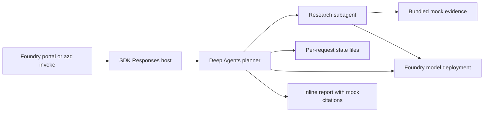

# Deep Agents on Microsoft Foundry

A research assistant adapted from the upstream Deep Research example. Deep
Agents plans, delegates to a research subagent, uses tools and working files, and returns a
cited report. The model runs in Foundry; `langchain-azure-ai` supplies the model
wrapper and Responses host. Search uses bundled, clearly labeled fictional
evidence. No Tavily key or other search subscription is required.

The SDK's [configuration-driven runner](https://docs.langchain.com/oss/python/integrations/providers/microsoft#use-the-configuration-driven-runner)
loads `create_graph` from `src/main.py` through `src/langgraph.json`. Agent code
only constructs the graph; local and hosted startup commands select the
Responses server without a custom server entry point.

## What this template is for

- Learn how to host a LangChain/LangGraph Deep Agents workflow on Foundry.
- Deploy a research agent with planning, subagent delegation, tool calls and
  report generation using a Foundry model.
- Explore the workflow with bundled fictional evidence and no external search
  API key.
- Use the template as a starting point for your own research tools and prompts.

## What this template is not for

This template is not a live web research service or a complete production
architecture. The fixture products, prices and URLs are fictional. It does not
provide shell execution, durable workspace files, checkpoint recovery or
cross-conversation memory.

Review [Cost planning](docs/cost.md) before provisioning.

## Architecture



The native `microsoft.foundry` azd provider provisions the Foundry resources
required for a project, the declared `gpt-4.1-mini` model deployment and the
Hosted Agent. You supply an Azure subscription, a supported region with model
quota, and an identity allowed to provision resources and role assignments.
The hosted runtime uses managed identity; local model calls use
`DefaultAzureCredential`. No API keys belong in source control.

`StateBackend` keeps working files inside graph state for one request. They
are not physical session files or downloadable artifacts and do not survive
another request or process restart. The final report is returned inline.

## Run the agent

Run every command from the `deep-agents` directory.

### 1. Prerequisites

- Azure CLI
- Azure Developer CLI (`azd`) 1.32 or newer
- The `azure.ai.agents` extension beta.9 or newer and the native
  `microsoft.foundry` infrastructure provider
- Python 3.13 with pip for local development and tests
- An Azure subscription, a supported region with model quota, and permission
  to create resources and role assignments

Sign in and install the required extensions:

```powershell
az login
azd auth login
azd extension install azure.ai.agents
azd extension install microsoft.foundry
```

### 2. Provision and deploy

```powershell
azd env new deep-agents-demo
azd up
```

Select a supported subscription and region when prompted. `azure.yaml` pins
the model name, version, SKU and capacity; change its deployment block before
provisioning if your region or quota requires a different tool-capable model.
The native provider supplies `FOUNDRY_PROJECT_ENDPOINT` and resolves the model
deployment environment variable for the hosted service.

### 3. Test the agent

```powershell
azd ai agent invoke deep-agents --new-session --protocol responses "Compare the fictional Cedar and Maple document processing services using the bundled mock evidence. Plan the work, delegate research, save and read the final report, and return the report inline."
```

The same prompt can be used in the deployed agent's Foundry playground.
Verify the following:

- The run completes through the Responses endpoint. Tool activity shows
  `write_todos`, `task`, `mock_search`, `write_file` and `read_file`.
- The inline report is labeled MOCK / FICTIONAL TEST DATA, compares Cedar and
  Maple, and cites only the bundled `https://example.com/mock/` identifiers.
- The reported fixture facts are accurate: 12 vs 18 credits per 1,000 pages,
  80 vs 120 pages/minute and 7 vs 1 days retention.
- A request about an unsupported real-world topic reports the evidence gap,
  without pretending to search the web or presenting fixtures as real facts.

Agent behavior is model-driven; inspect tool activity as well as final prose.
Offline tests do not verify Azure connectivity or model-generated results.
After source changes, use `azd deploy` and repeat the same verification prompt.

## Local development

Create a virtual environment using Python 3.13 (the deployed runtime) and
install the pinned direct dependencies:

```powershell
py -3.13 -m venv .venv
.venv/Scripts/python -m pip install -r src/requirements.txt
.venv/Scripts/python -m unittest discover -s tests -v
```

On Linux/macOS use `python3.13` and `.venv/bin/python`. This check drives the
real graph with a scripted model through planning, delegation, mock tool use,
file writing/reading and report completion; it also checks request isolation.
It makes no Azure calls.

After `az login`, set `FOUNDRY_PROJECT_ENDPOINT` and
`AZURE_AI_MODEL_DEPLOYMENT_NAME` in your shell to your own project's values.
For the azd development workflow, run `azd ai agent run deep-agents` from this
directory; it installs dependencies and starts the host and Agent Inspector.
Use the Inspector to send the verification prompt and inspect tool activity.
Alternatively, with the dependencies installed, run the SDK runner directly
from this directory:

```powershell
.venv/Scripts/python -m langchain_azure_ai.agents.hosting.run --config src/langgraph.json --protocol responses --host 127.0.0.1
```

The graph factory reads shell variables; it does not load a `.env` file. In
another terminal you can invoke either host:

```powershell
azd ai agent invoke deep-agents --local --protocol responses "Compare Cedar and Maple using the mock evidence. Return the full report inline."
```

Local model calls are billable. Do not expose the local development host to
untrusted networks. The hosting SDK automatically initializes OpenTelemetry
and uses the runtime's telemetry configuration; Foundry also emits service-side
invocation traces. No custom exporter is configured by this template. See
[Hosted agent tracing](https://learn.microsoft.com/azure/foundry/observability/quickstarts/quickstart-tracing-hosted-agent).
The deployment disables LangSmith tracing and message-content recording, not
tracing itself. These settings do not disable Foundry conversation history or
override service retention policies.

## Customize

- Change `src/mock_evidence.json` to explore other fictional comparisons.
  Update the coordinator and researcher instructions in `src/agent.py` to
  describe the new evidence scope.
- Replace `mock_search` in `src/agent.py` with your own research tool and update
  the prompts, tests and mock labels to match its behavior.
- Configure the model deployment in `azure.yaml` before provisioning.

## Troubleshooting

- Authentication or authorization failures: check the selected Azure identity
  and its Foundry project/model access. Do not add keys to fix a role issue.
- Model deployment failures: check the region, model version, SKU and quota
  in `azure.yaml`; retry with a supported deployment configuration.
- Missing extensions: update azd and install the required extensions.
- Incomplete workflow: inspect `azd ai agent monitor` output and the tool
  activity; keep logs local and redact identities and resource IDs before sharing.

## Cleanup

```powershell
azd down
```

Review the resource deletion prompt; remove only this environment's resources.
Local `.azure`, `.env`,
virtual environments and logs are ignored by Git. Never paste their contents
into a public issue or commit.

## License and attribution

This template is licensed under the repository [MIT License](../LICENSE). See
[Attribution](ATTRIBUTION.md) for adapted examples and upstream license notices.
