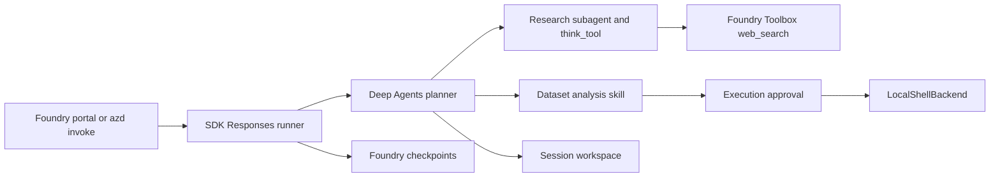

# Deep Agents on Microsoft Foundry

A LangChain/LangGraph Deep Agents solution template for Foundry. Its example
workflow plans next-quarter marketing for fictional B2B software lines Cedar
and Maple, combining sales analysis with cited external research. It demonstrates
planning, subagents, skills, files, human approval and checkpoints together.

The research patterns are inspired by the upstream Deep Research sample; this
is a separate workflow, not an identical port. See [Attribution](ATTRIBUTION.md).

## What this template is for

- Adapt a Deep Agents workflow to Foundry using the SDK configuration-driven runner.
- Research public sources with managed web search and consolidated citations.
- Demonstrate local skills, approved code execution, session files and checkpoints.

## What this template is not for

A complete production architecture, long-term memory solution or shell security
sandbox. The bundled sales dataset is fictional. Research budgets are prompt
instructions, not enforced quotas.

[Cost planning](docs/cost.md) is pending.

## Architecture



The template creates a Foundry project, model deployment, Toolbox and Hosted
Agent. You provide the subscription, deployment permissions and model quota.

Working files live under `$HOME/deep-agents` when hosted and `.workspace`
locally. File tools can write only to `/work/`; skills and data remain readable.
`write_file` and shell execution require approval, including in subagents.
`edit_file` and `delete` still use path permissions without separate approval.
Shell is **not confined by file-tool permissions**; review commands and scripts.

## Run the agent

Run commands from `deep-agents`.

### 1. Prerequisites

- Azure CLI and Azure Developer CLI (`azd`) 1.32 or newer.
- Python 3.13 with pip for local development.
- Permission to create resources and role assignments, and available model quota.

```powershell
az login
azd auth login
azd extension install microsoft.foundry
azd extension install azure.ai.agents
azd extension install azure.ai.toolboxes
```

### 2. Provision and deploy

```powershell
azd env new deep-agents-demo
azd up
```

The default model is `gpt-5.6-luna` version `2026-07-09`, using GlobalStandard
capacity 10. To change it, update `azure.yaml`; keep the concrete deployment
name and `AZURE_AI_MODEL_DEPLOYMENT_NAME` aligned.

### 3. Test the agent

```powershell
azd ai agent invoke deep-agents --new-session --new-conversation --protocol responses "Analyze our bundled Cedar and Maple sales data and recommend next quarter's marketing priorities. Research credible B2B software marketing practices, calculate growth, profit margins and revenue contribution with Python after approval, and produce one cited report separating simulated data, external evidence and assumptions. Propose small measurable experiments without inventing ROI, CAC or a budget."
```

Approve file writes and the reviewed calculation command as prompted. The
deliverable is `/work/final_report.md`, supported by `/work/analysis_report.md`.
The sales data cannot establish marketing causation, ROI or CAC. In the same
conversation, try: "Prioritize retention with a small team and revise the plan."

See [Validation](docs/validation.md) for research checks, the REST approval
procedure, session continuity and offline tests.

## Local development

```powershell
py -3.13 -m venv .venv
.venv/Scripts/python -m pip install -r src/requirements.txt
.venv/Scripts/python -m unittest discover -s tests -v
```

On Linux/macOS use `python3.13` and `.venv/bin/python`.

Set `FOUNDRY_PROJECT_ENDPOINT` and `AZURE_AI_MODEL_DEPLOYMENT_NAME` in your shell
for an existing project/model, then start the agent with its deployed Toolbox:

```powershell
$env:TOOLBOX_NAME = 'deep-agents-tools'
$env:OTEL_INSTRUMENTATION_GENAI_CAPTURE_MESSAGE_CONTENT = 'false'
$env:AZURE_TRACING_GEN_AI_CONTENT_RECORDING_ENABLED = 'false'
$env:LANGSMITH_TRACING = 'false'
$env:AGENTSERVER_STATE_ROOT = Join-Path (Get-Location) '.agentserver'
azd ai agent run deep-agents
```

Tests are offline; local agent runs use billable model and search services.

## Customize

- Research prompts and tool selection: `src/agent.py` and `src/main.py`.
- Analysis skill and inputs: `src/skills/` and `src/data/`. Use a new session
  after changing bundled files; existing session copies are preserved.
- Model and Toolbox: `azure.yaml`. The graph loads only `web_search`.

Deploy source changes with `azd deploy deep-agents`. For Toolbox changes,
first run `azd deploy deep-agents-tools`, inspect
`azd ai toolbox versions list deep-agents-tools`, and publish the intended
version with `azd ai toolbox publish deep-agents-tools <version>`.
Then redeploy the agent to reload its tools.

## Cleanup

```powershell
azd down
```

Review the target resources before confirming deletion.

## References

- [Validation and approval workflow](docs/validation.md)
- [Microsoft Foundry hosted agents](https://learn.microsoft.com/azure/foundry/agents/concepts/hosted-agents)
- [Repository license](../LICENSE) and [upstream attribution](ATTRIBUTION.md)
