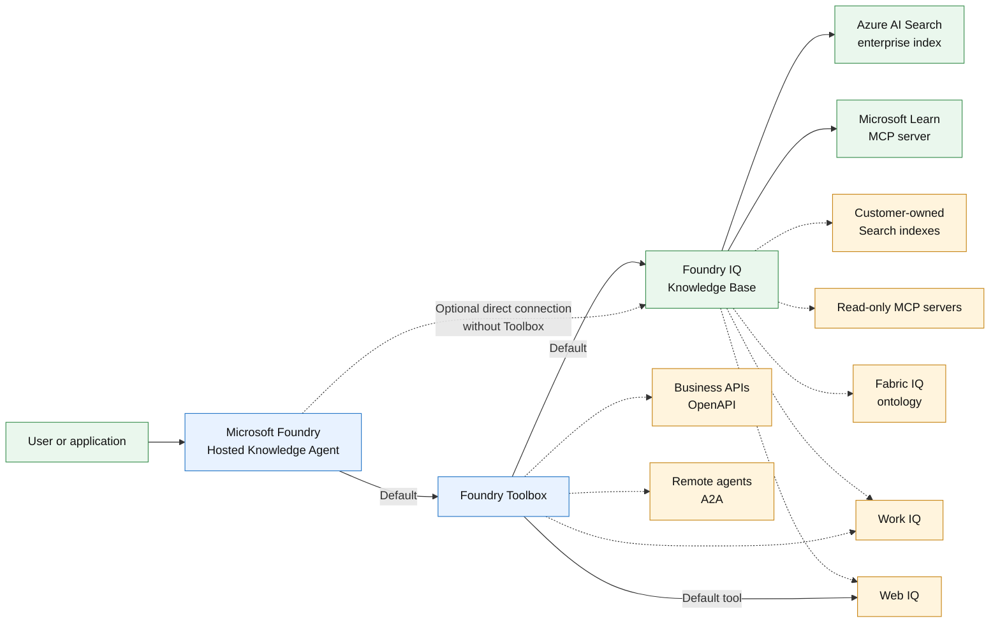

# Enterprise Knowledge Agent

An extensible enterprise knowledge assistant that answers questions using organizational content, Microsoft product documentation, and current public web information, with citations to its sources. The template deploys a Microsoft Foundry Hosted Agent with a working synthetic enterprise knowledge index and shows how to connect customer-owned Search indexes, MCP servers, Fabric ontologies, Work IQ tools, business APIs, and other agents.

## What this template is for

- Learn how a Microsoft Foundry Hosted Agent can use one Toolbox for both governed enterprise retrieval and current public information.
- Deploy a working keyless example with a synthetic Azure AI Search index, Microsoft Learn grounding, citations, and Web IQ.
- Connect existing customer-owned Search indexes, MCP servers, Fabric ontologies, Work IQ tools, APIs, or remote agents through inactive configuration examples.
- Use configuration ordering, duplicate detection, external-source preflight, idempotent reprovisioning, and ownership-aware cleanup safeguards.
- Provide a starting point for an adopter-specific enterprise knowledge assistant.

## What this template is not for

This template is not a production-ready or multitenant application. It does not ingest, parse, chunk, migrate, synchronize, or govern customer data; crawl SharePoint; create Fabric or Microsoft 365 content; provide document-level authorization; deploy private networking; add centralized monitoring; provide backup or disaster recovery; or include a user interface or support SLA. Except for the synthetic Search demo, external sources must already exist and remain customer-owned.

Review [Cost planning](docs/cost.md) and [customer data onboarding](docs/data-onboarding.md) before provisioning or connecting customer sources.

## Architecture



Solid lines show the default template; dashed lines show optional extensions. See [Architecture](docs/architecture.md) for connection details and the Toolbox-free Foundry IQ option.

## Deploy

Required tools:

- Azure CLI
- Azure Developer CLI (`azd`)
- PowerShell (`pwsh`)
- Python with pip
- Terraform when using the default Terraform deployment; the Bicep deployment uses Azure CLI's Bicep support instead

Verify the command-line prerequisites before creating an environment:

```powershell
az version
azd version
pwsh --version
python -m pip --version
terraform version # Required only for the default Terraform path.
```

The deploying identity needs permission to create resources and role assignments.

Install the azd extensions used by the template:

```powershell
azd extension install microsoft.foundry
azd extension install azure.ai.agents
azd extension install azure.ai.connections
azd extension install azure.ai.toolboxes
```

Run every command from this folder in PowerShell 7. Terraform is active by default. To use Bicep, temporarily swap the manifests before creating the environment:

```powershell
Rename-Item azure.yaml azure-terraform.yaml
Rename-Item azure-bicep.yaml azure.yaml
```

Keep the Bicep manifest named `azure.yaml` throughout provisioning, deployment, invocation, and cleanup. Do not restore Terraform before completing those commands.

After selecting the manifest, configure and deploy:

```powershell
az login
azd auth login
$subscriptionId = az account show --query id --output tsv
$environmentName = 'enterprise-knowledge-terraform-dev' # Use a distinct name for Bicep.
azd env new $environmentName --subscription $subscriptionId --location <foundry-region> --no-prompt
azd env set AZURE_PRINCIPAL_ID (az ad signed-in-user show --query id --output tsv) # For interactive deployment.
azd env set AZURE_SEARCH_LOCATION westus2
azd env set AZURE_SEARCH_SKU basic
azd env set AZURE_SEARCH_MODE demo
azd env set AZURE_AI_MODEL_DEPLOYMENT_NAME gpt-5.4-mini
azd provision --preview foundry --no-prompt
azd up --no-prompt
```

Replace the region placeholder with a region that supports the pinned model version and has at least 10K TPM of available `GlobalStandard` quota. The Foundry-layer preview checks this before creating resources. Because this is a layered project, preview one layer at a time; an unqualified `azd provision --preview` is not supported, and the Search-layer preview becomes available only after the Foundry layer exports its resource-group output.

The Foundry layer creates and exports its resource-group name; both Search implementations consume that output. The default `AZURE_SEARCH_MODE=demo` creates the synthetic Search service in that group. `AZURE_SEARCH_LOCATION` defaults to `westus2` and `AZURE_SEARCH_SKU` to `basic`; the explicit commands keep those choices visible. For an existing Search service, do not use the single-command demo flow: follow the two-phase [customer data onboarding](docs/data-onboarding.md) procedure for `AZURE_SEARCH_MODE=byo`, customer RBAC, and the second deploy.
For CI or workload-identity deployment, set `AZURE_PRINCIPAL_ID` to that identity's object ID instead of running the signed-in-user lookup.

Infrastructure is intentionally separated into `infra-terraform` and `infra-bicep`. The manifests also use provider-specific project and template names for tracking. Use different environment names and resource groups when comparing implementations.

Try all three paths:

```powershell
azd ai agent invoke enterprise-knowledge-agent "What is the Project Northstar travel approval code? Cite the source."
azd ai agent invoke enterprise-knowledge-agent "What is one current announcement on the official Microsoft Azure blog? Use web search and cite an HTTPS source."
azd ai agent invoke enterprise-knowledge-agent "Use knowledge_base_retrieve, not web search. According to Microsoft Learn, explain Azure AI Search agentic retrieval and cite the documentation."
```

These examples cover enterprise content, current web information, and Microsoft Learn grounding. Responses include citations when supported by the selected source.
The first Hosted Agent invocation can take longer while its session starts. If it returns a transient `session_not_ready` or HTTP 424 error, wait briefly and retry the same command.

Clean up in reverse dependency order with `azd down --purge --force`. Search objects, Toolbox, and connection resources use stable environment-scoped names, so multiple environments can safely share a customer Search service. The pre-down hook removes only objects recorded as owned by the active environment.

After finishing the Bicep workflow, restore the Terraform manifest:

```powershell
Rename-Item azure.yaml azure-bicep.yaml
Rename-Item azure-terraform.yaml azure.yaml
```

For later operations, use the manifest matching that environment and select it with `azd env select <environment-name>` before running `azd` commands. Separate copies of this folder are recommended when comparing both implementations concurrently.

See [data source placement](docs/data-sources.md), [customer data onboarding](docs/data-onboarding.md), [customization](docs/customization.md), and [cost planning](docs/cost.md).
