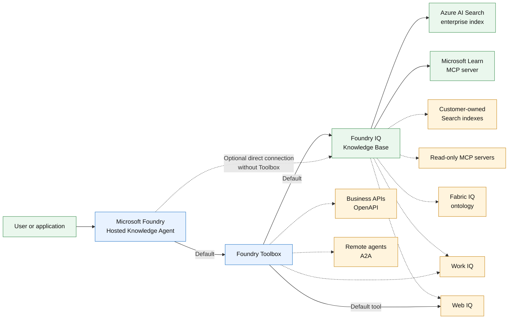

# Enterprise Knowledge Agent

An extensible enterprise knowledge assistant that answers questions using organizational content, Microsoft product documentation, and current public web information, with citations to its sources. The template deploys a Microsoft Foundry Hosted Agent with a working synthetic enterprise knowledge index and shows how to connect customer-owned Search indexes, MCP servers, Fabric ontologies, Work IQ tools, business APIs, and other agents.

## What this template is for

- Learn how a Microsoft Foundry Hosted Agent can use one Toolbox for both governed enterprise retrieval and current public information.
- Deploy a working keyless example with a synthetic Azure AI Search index, Microsoft Learn grounding, citations, and Web IQ.
- Connect existing customer-owned Search indexes, MCP servers, Fabric ontologies, Work IQ tools, APIs, or remote agents through inactive configuration examples.
- Validate configuration ordering, duplicate detection, external-source preflight, idempotent reprovisioning, and ownership-aware cleanup.
- Provide a starting point for an adopter-specific enterprise knowledge assistant.

## What this template is not for

This template is not a production-ready or multitenant application. It does not ingest, parse, chunk, migrate, synchronize, or govern customer data; crawl SharePoint; create Fabric or Microsoft 365 content; provide document-level authorization; deploy private networking; add centralized monitoring; provide backup or disaster recovery; or include a user interface or support SLA. Except for the synthetic Search demo, external sources must already exist and remain customer-owned.

Review [Cost planning](docs/cost.md) and [customer data onboarding](docs/data-onboarding.md) before provisioning or connecting customer sources.

## Architecture



Solid lines show the default template; dashed lines show optional extensions. See [Architecture](docs/architecture.md) for connection details and the Toolbox-free Foundry IQ option.

## Deploy

Terraform is the default infrastructure option. Install Azure CLI, Azure Developer CLI, Terraform 1.9 or later, and the `microsoft.foundry` azd extension. The Bicep option uses Azure CLI's Bicep support instead of Terraform. The deploying identity needs permission to create resources and role assignments.

Run every command from this folder. Terraform is active by default. To use Bicep, temporarily swap the manifests before creating the environment:

```powershell
Rename-Item azure.yaml azure-terraform.yaml
Rename-Item azure-bicep.yaml azure.yaml
```

Run all Bicep `azd` commands while the Bicep manifest is named `azure.yaml`, then restore Terraform:

```powershell
Rename-Item azure.yaml azure-bicep.yaml
Rename-Item azure-terraform.yaml azure.yaml
```

After selecting the manifest, configure and deploy:

```powershell
az login
azd auth login
$subscriptionId = az account show --query id --output tsv
$environmentName = 'enterprise-knowledge-terraform-dev' # Use a distinct name for Bicep.
azd env new $environmentName --subscription $subscriptionId --location <foundry-region> --no-prompt
azd env set AZURE_PRINCIPAL_ID (az ad signed-in-user show --query id --output tsv) # For interactive deployment.
azd env set AZURE_SEARCH_LOCATION westus2
azd env set AZURE_SEARCH_SKU basic
azd env set AZURE_SEARCH_MODE demo
azd env set AZURE_AI_MODEL_DEPLOYMENT_NAME gpt-5.4-mini
azd up --no-prompt
```

Replace the region placeholder with a region that has model quota. The Foundry layer creates and exports its resource-group name; both Search implementations consume that output. The default `AZURE_SEARCH_MODE=demo` creates the synthetic Search service in that group. `AZURE_SEARCH_LOCATION` defaults to `westus2` and `AZURE_SEARCH_SKU` to `basic`; the explicit commands keep those choices visible. For an existing Search service, follow the customer-data onboarding guide and set `AZURE_SEARCH_MODE=byo`, `AZURE_SEARCH_ENDPOINT`, and `AZURE_SEARCH_SERVICE_ID` before `azd up`.
For CI or workload-identity deployment, set `AZURE_PRINCIPAL_ID` to that identity's object ID instead of running the signed-in-user lookup.

Infrastructure is intentionally separated into `infra-terraform` and `infra-bicep`. The manifests also use provider-specific project and template names for tracking. Use different environment names and resource groups when comparing implementations.

Try all three paths:

```powershell
azd ai agent invoke enterprise-knowledge-agent "What is the Project Northstar travel approval code? Cite the source."
azd ai agent invoke enterprise-knowledge-agent "What is one current announcement on the official Microsoft Azure blog? Use web search and cite an HTTPS source."
azd ai agent invoke enterprise-knowledge-agent "According to Microsoft Learn, explain Azure AI Search agentic retrieval and cite the documentation."
```

The first and third calls should use `knowledge_base_retrieve`; the second should use `web_search`. Exact current web wording is intentionally not asserted. This template uses preview Foundry IQ APIs and billable Search/model/tool usage. Transient `429`, cold-start `424`, and service-preview failures should be retried after the server-provided delay.

Clean up in reverse dependency order with `azd down --purge --force`. The pre-down hook removes only objects with the template's fixed names from the active environment's Search service, followed by Toolbox and connection resources.

See [data source placement](docs/data-sources.md), [customer data onboarding](docs/data-onboarding.md), [customization](docs/customization.md), and [cost planning](docs/cost.md).
