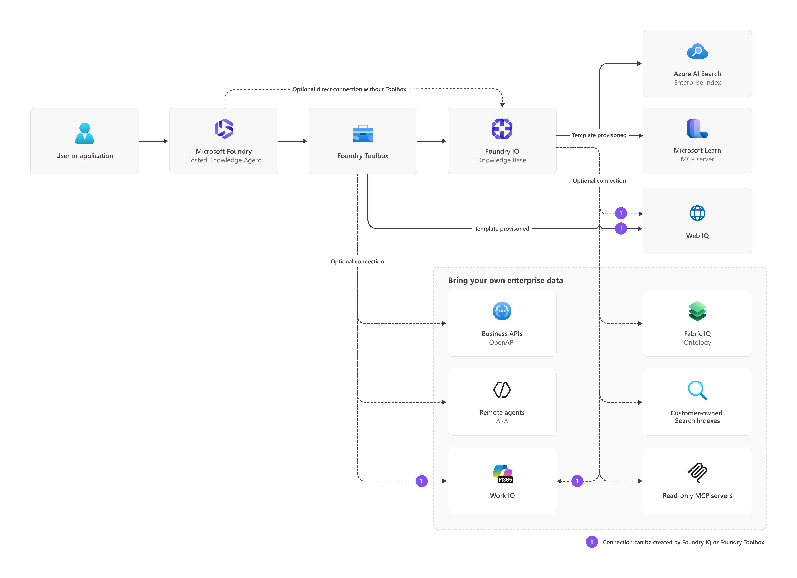

# Architecture

The default deployment routes the Microsoft Foundry Hosted Agent through one Foundry Toolbox. The Toolbox exposes the Foundry IQ Knowledge Base and Web IQ.

The dashed connections show optional extensions. A knowledge-only agent can connect directly to the Foundry IQ Knowledge Base without a Toolbox. Some capabilities can be integrated either as Knowledge Sources or as Toolbox peer tools, depending on the retrieval, action, identity, and operational requirements. The diagram shows template defaults and supported extension points; it does not recommend connecting the same capability through both paths. See [Data source and tool placement](data-sources.md) for the selection criteria and maintained template paths.

Solid lines represent the default template. Dashed lines represent optional connections or sources that require adopter-specific configuration and validation.
