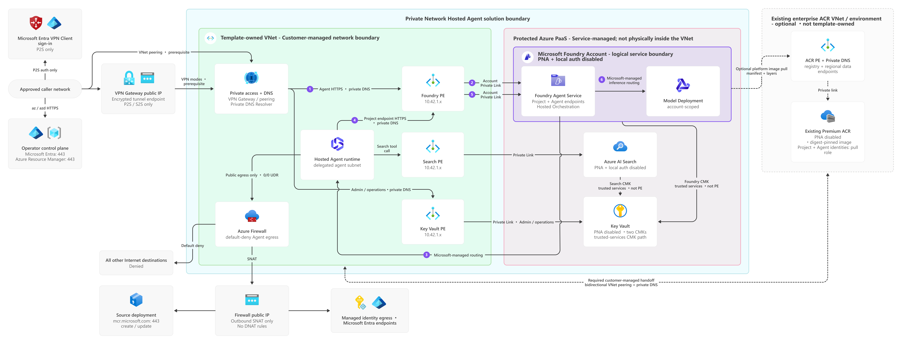

# Microsoft Foundry private-network Hosted Agent solution template

A Terraform + azd reference implementation for a Python 3.13 Microsoft Foundry
Hosted Agent that queries Azure AI Search over private connectivity with
managed identity and citations. Terraform in `infra-terraform` is the default;
an equivalent Bicep companion is retained in `infra-bicep`.

The template demonstrates a **private, fail-closed application data plane**.
Here, *fail closed* means that a failure denies access instead of falling back
to public access or weaker authentication. Foundry, Search, and Key Vault public
access is disabled; local/key authentication is disabled where supported; Agent
egress is restricted through Azure Firewall; and Foundry and Search use separate
customer-managed keys.

> **Current maturity:** this is a validated preventive baseline, not a security,
> privacy, compliance, availability, or production certification. Production
> adopters must complete the workload-specific gates in
> [Production adoption](docs/production-readiness.md).

## What this template is for

- Learn and review private Foundry Hosted Agent architecture.
- Deploy a deterministic Search-grounded sample through Terraform and azd, or
  use the supported Bicep companion.
- Validate private endpoints, DNS, RBAC, CMK, public-access rejection, and Agent
  invocation.
- Provide a secure starting point for a customer design without weakening
  controls when a dependency fails.

## What this template is not for

It is not a production-ready, air-gapped, or multitenant application, and it
does not provide customer data ingestion, document-level authorization,
centralized monitoring, backup/DR, multiregion failover, a web UI, or a
production support SLA.

See [Solution overview](docs/solution-overview.md) for audience, use cases, and
the complete support boundary.

## Architecture



The solution deploys:

- a template-owned VNet with delegated Agent, private endpoint, Firewall, VPN,
  and DNS Resolver subnets;
- P2S, S2S, or VNet peering connectivity;
- a Foundry account/project and a pinned regional model deployment;
- a Python 3.13 source-deployed Hosted Agent using Responses protocol 2.0;
- private Azure AI Search with keyless authentication;
- a private Key Vault with separate Foundry and Search CMKs;
- private endpoints and DNS for the application data plane.

Python 3.13 above refers to the Foundry-managed runtime selected by
`azure.yaml`, not necessarily the Python version installed on an operator's
workstation. Python is not needed to invoke an existing Agent. For local tests,
Search seeding, and source deployment, Python 3.13 is the documented and tested
baseline; see [First deployment](docs/deployment.md) for details.

An opt-in scenario can consume a digest-pinned image from an existing
enterprise private ACR. The template creates only the Foundry registry
connection; it does not create or manage the registry, image, ACR network, or
ACR IAM.

This is not an air-gapped or zero-public-egress system. VPN endpoints, operator
control-plane access, managed identity, and source deployment have documented
public dependencies. See [Architecture](docs/architecture.md).

## Choose a deployment

| Mode | Provide | Package source | Manual handoff |
|---|---|---|---|
| `Source` (default) | Subscription ID | Python 3.13 source built by Foundry with `remote_build` | Complete the selected connectivity handoff; for P2S, connect the exported VPN profile |
| `ExistingPrivateAcr` | Subscription ID, ACR resource ID, exact endpoint, digest-pinned image | Existing enterprise private ACR | Complete the selected connectivity and ACR network handoffs; have the ACR owner grant the printed pull role to the Foundry project and Agent identities |

The template always creates a dedicated `rg-<environment-name>` resource group.
To start or safely resume the default Terraform workflow:

```powershell
./scripts/deploy.ps1 `
  -DeploymentMode Source `
  -SubscriptionId "<subscription-id>"
```

The azd environment stores local deployment state and its target resource group.
When `-EnvironmentName` is omitted, the script resumes a compatible default
environment or creates a generated environment and group. For a separate test,
provide a previously unused `-EnvironmentName`.

To use the Bicep companion instead, add
`-InfrastructureProvider Bicep` to the same command. Source deployments then use
`scenarios\bicep` and existing-private-ACR deployments use
`scenarios\bicep-existing-private-acr`; the Terraform paths are the template
root and `scenarios\existing-private-acr`, respectively.

Terraform state is local. Keep `*.tfstate*` and `.terraform\` ignored, retain the
committed `infra-terraform\.terraform.lock.hcl`, and never reuse an environment
between Terraform and Bicep.

See [Unified deployment](docs/deployment.md) for both commands, ownership,
preview, resume, VPN, and ACR IAM behavior.

## Choose another workflow

| Goal | Start here |
|---|---|
| Decide whether the template fits | [Solution overview](docs/solution-overview.md) |
| Review production gaps before adoption | [Production adoption](docs/production-readiness.md) |
| Deploy from source code or an existing private ACR image | [Unified deployment](docs/deployment.md) |
| Prepare private ACR prerequisites | [Existing private ACR](docs/existing-private-acr.md) |
| Configure regions, networking, model, or ACR values | [Configuration reference](docs/configuration.md) |
| Customize the sample while preserving security controls | [Customization](docs/customization.md) |
| Grant access or test an existing environment | [Coworker handoff](docs/deployment.md#existing-environment-and-coworker-handoff) |
| Diagnose a failure | [Troubleshooting](docs/troubleshooting.md) |
| Operate an environment | [Operations](docs/operations.md) |
| Remove an environment safely | [Cleanup](docs/cleanup.md) |

## Additional references

- [Architecture and trust boundaries](docs/architecture.md)
- [Security controls and shared responsibility](docs/security.md)
- [Cost planning](docs/cost.md)
- [Connectivity, DNS, and routing](docs/connectivity.md)
- [Validation](docs/validation.md)
- [Private ACR troubleshooting](docs/troubleshooting-existing-private-acr.md)
- [Release and upgrade guidance](docs/release-and-upgrade.md)
- [Support](SUPPORT.md) and [security reporting](https://github.com/microsoft/Foundry-Agent-Solution-Templates/security/policy)

## Safety rules

- Do not enable public fallback, local/key authentication, anonymous ACR pull,
  or broader RBAC to make deployment or validation pass.
- Never store a site-to-site shared key in source, azd environment files,
  output, logs, or fixtures.
- Do not commit `.azure/<environment>/`, generated VPN profiles, credentials, or
  customer data. Do not share azd environment state, credentials, or customer
  data between users; transfer VPN profiles only through an approved secure
  channel.
- Review current Microsoft documentation for regions, quotas, preview status,
  CMK support, privacy, and platform limits before every production decision.

## License and attribution

This template is licensed under the repository [MIT License](../LICENSE). See
[Attribution](ATTRIBUTION.md) for adapted patterns and upstream sources.
