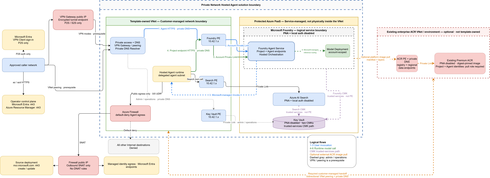

# Architecture

The editable [Draw.io source](diagrams/architecture.drawio) is provided
alongside the generated SVG.

The outer box is a **private data-plane security boundary**, not a statement
that every Azure PaaS resource is physically deployed inside a customer subnet.
The Hosted Agent runtime is service-managed and uses a dedicated NIC in the
delegated Agent subnet. Private endpoint NICs, Firewall, routes, VPN Gateway,
and DNS Resolver are deployed in the template-owned VNet. Foundry, Search, and
Key Vault remain service-managed Azure PaaS resources, with public access
disabled and private data-plane access exposed into the VNet through private
endpoints.

The optional ACR path adds an external, enterprise-owned PaaS dependency. The
template creates only the Foundry project connection; it does not own the
registry, source image, ACR Private Endpoint/DNS, or ACR IAM. The registry login
server and dedicated data endpoints resolve through `privatelink.azurecr.io`.
azd passes the digest-pinned pre-built image directly to Foundry when
`AZD_AGENT_SKIP_ACR=true`. The scenario sets `docker.remoteBuild: true` only to
make azd core's framework package phase a no-op; the agents extension does not
build, pull, retag, publish, or run an ACR Task on this path.

This is the accurate Azure meaning of "protected by the VNet": callers and the
Hosted Agent reach the PaaS data planes through private IPs and Private Link.
The PaaS services themselves aren't moved into the VNet.

## Foundry-to-model invocation path

The diagram places the model deployment **inside the service-managed Foundry
account boundary**, not inside the customer VNet. The project and model
deployment are separate children of the same Foundry account. The Hosted Agent
calls the model by using the project endpoint. For this template, both access to
the Foundry resource/account endpoint and access to its project endpoint use the
same **account-scoped Private Endpoint** and linked Private DNS zones. They are
not separate Private Link resources.

The following evidence distinguishes Microsoft-documented platform behavior
from this template's implementation:

| Statement shown in the diagram | Evidence and scope |
|---|---|
| A model deployment belongs to the Foundry account, alongside the project. | Microsoft Learn's [Hosted agent permissions reference — Foundry account setup](https://learn.microsoft.com/azure/foundry/agents/concepts/hosted-agent-permissions#foundry-account-setup) depicts `Model Deployment` and `Foundry Project` beneath `Foundry Account`. In this template, `infra/modules/foundry.bicep` declares both `Microsoft.CognitiveServices/accounts/deployments` and `Microsoft.CognitiveServices/accounts/projects` with the account as parent. |
| A Hosted Agent can perform model inference through the project endpoint. | Microsoft Learn's [Deploy a hosted agent from source code](https://learn.microsoft.com/azure/foundry/agents/how-to/deploy-hosted-agent-code) states that the platform-assigned agent identity can access model inferencing through the project endpoint by default. This agent constructs `AIProjectClient` from `FOUNDRY_PROJECT_ENDPOINT`, obtains its OpenAI client, and selects `AZURE_AI_MODEL_DEPLOYMENT_NAME` in `agent/search-agent/main.py`. |
| A VNet client using the Foundry Private Endpoint reaches both the Foundry resource/account endpoint and its project endpoint over Private Link. | Microsoft Learn's [How to configure network isolation for Microsoft Foundry — DNS configuration](https://learn.microsoft.com/azure/foundry/how-to/configure-private-link#dns-configuration) states that VNet clients use the same connection string as public-endpoint clients and that DNS resolution routes connections to the Foundry resource **and projects** over a private link. The public-form endpoint name therefore does not imply public-Internet transport when it resolves to the Private Endpoint address. |
| Account and project access share one account-scoped Private Endpoint; there is no separate project or model-deployment Private Endpoint in this design. | Microsoft Learn's [Set up private networking for Foundry Agent Service — DNS zone configurations summary](https://learn.microsoft.com/azure/foundry/agents/how-to/virtual-networks#dns-zone-configurations-summary) identifies the Foundry Private Link resource as subresource `account` and lists `privatelink.cognitiveservices.azure.com`, `privatelink.openai.azure.com`, and `privatelink.services.ai.azure.com`. The template uses group ID `account`, targets the Foundry account, and links those three zones in `infra/modules/foundry.bicep` and `infra/modules/private-dns.bicep`. |
| The Hosted Agent runtime has VNet-attached outbound connectivity. | Microsoft Learn's [Deep dive into Foundry Agent Service networking — Hosted agent path](https://learn.microsoft.com/azure/foundry/agents/concepts/agents-networking-deep-dive#hosted-agent-path) states that the Micro VM has a dedicated NIC in the delegated subnet for the agent's own outbound traffic. The template configures Foundry `networkInjections` for that subnet. |
| Private Link traffic from the VNet to the Azure service stays on the Microsoft backbone and isn't exposed to the public Internet. | Microsoft Learn's [Secure your Azure Private Link deployment](https://learn.microsoft.com/azure/private-link/secure-private-link) states that traffic between a virtual network and a service through Private Link travels the Microsoft backbone network, eliminating exposure to the public Internet. This statement covers the customer-VNet-to-Foundry Private Link segment; it does not document Foundry's internal model-routing implementation. |

Taken together, those documented behaviors and template configuration support
the specific path shown here:

`Hosted Agent runtime -> project endpoint hostname -> Foundry account Private
Endpoint -> Foundry project -> Microsoft-managed inference routing ->
account-scoped model deployment`.

This conclusion is specific to this template's endpoint usage, Private DNS
links, disabled public network access, and account Private Endpoint. Microsoft
Learn documents the public API relationship: the project endpoint is a URL
under the Foundry account hostname, and model deployments are account-scoped.
Microsoft's public Azure SDK constructs the OpenAI-compatible client by
appending `/openai/v1` to that project endpoint; see
[`AIProjectClient.get_openai_client`](https://github.com/Azure/azure-sdk-for-python/blob/main/sdk/ai/azure-ai-projects/azure/ai/projects/_patch.py).

However, Microsoft Learn and the public SDK/API specifications do **not**
describe the lower-level, service-internal packet path from the project-scoped
API surface to the model deployment. They do not identify an internal gateway,
hostname, IP address, transport protocol, Private Link hop, VNet, or per-hop
network topology for that segment. The diagram therefore uses a dashed logical
edge labeled **Microsoft-managed inference routing**. It must not be interpreted
as proof of a distinct network connection, and it does not claim that the model
deployment is VNet-injected. Private Link is established only for the
customer-VNet-to-Foundry account/project endpoint segment shown before it.

The VNet uses Azure-provided DNS for linked Private DNS Zones. P2S/S2S and
peered external clients forward private-zone queries to the Private DNS
Resolver inbound endpoint; the VNet must not point its own custom DNS setting
back to that inbound endpoint.

Foundry, VNet, and Search locations are deployment parameters governed by the
[region and capacity selection requirements](configuration.md#region-and-capacity-selection).
Search is reached through a private endpoint in the VNet, so using a separate
supported Search region does not enable public access. Private endpoint flows
are not described as traversing Azure Firewall. The Firewall governs the agent
subnet's required public egress.

This solution does not claim that all traffic remains inside the VNet. Four
independent public dependencies exist:

1. P2S and S2S use a VPN Gateway public IP as the encrypted tunnel endpoint.
2. A P2S Azure VPN Client authenticates its user against Microsoft Entra before
   private application traffic can use the tunnel.
3. The Hosted Agent subnet sends allowlisted Microsoft identity and
   source-code provisioning traffic through Azure Firewall and its public IP.
4. An operator workstation uses Azure public control-plane endpoints for
   authentication, provisioning, RBAC, deployment inspection, and Agent
   management. This traffic originates outside the solution VNet and therefore
   does not traverse the solution Firewall.

All other Agent Internet egress is denied by default.

## Traffic outside the VNet

The public paths below are intentional security-review items. The design goal is
an explicitly controlled private data plane with documented Microsoft platform
and management-plane dependencies, not an air-gapped or zero-public-egress
system. See the
[security and compliance review matrix](security.md#security-and-compliance-review-matrix)
for source, destination, protocol, information type, lifecycle, and enforcement
details.

### Why each public dependency exists

These resources and endpoints have different purposes and must not be grouped
under a generic "Microsoft-required public services" label.

| Public dependency | Why it exists | Applies when | When it can be removed |
|---|---|---|---|
| VPN Gateway public IP | External endpoint for the encrypted OpenVPN or IPsec/IKE tunnel. It transports VPN packets; it does not perform Entra authentication. | `pointToSite` and `siteToSite` | Select `vnetPeering`. The template then deploys neither VPN Gateway nor its public IP. Removing it from a VPN mode removes the VPN path itself. |
| Microsoft Entra endpoints used by Azure VPN Client | Authenticates the human P2S user. This traffic originates on the client before or alongside tunnel establishment and does not traverse the solution Firewall. | `pointToSite` only | Select S2S or peering. A different P2S authentication design could change this dependency, but certificate and RADIUS modes are not implemented by this template. The VPN Gateway public IP would still be required. |
| Azure Firewall public IP | Azure Firewall Standard in this VNet deployment requires a static public IP. In this design it is also the SNAT address for the Agent subnet's approved public egress. There are no DNAT rules, so it is not an application ingress endpoint. | All connectivity modes | It cannot be removed from the current topology. A forced-tunneling redesign can remove the tenant data-path public IP, but Azure Firewall then uses a separate management public IP and an upstream device must provide the approved egress. That is relocation, not elimination, of the public dependency. |
| Microsoft Entra endpoints used by the Hosted Agent | The Agent's managed identity obtains tokens for authorized Azure calls during provisioning and runtime. | All connectivity modes | Not while this Hosted Agent uses managed identity for private Search and other Azure calls. Removing the rule breaks token acquisition; changing VPN mode has no effect. |
| `mcr.microsoft.com` | Microsoft requires it for source-code Hosted Agent provisioning. This template uses Python 3.13 with `remote_build`. | Agent version creation and update | Microsoft documents this as a deployment-time dependency. A customer could close it only between deployments and reopen it before create, update, or recovery, but that would be an operational policy outside this always-redeployable template baseline. |
| Microsoft Entra and ARM used by `az` / `azd` | Authenticates the operator and performs Azure management-plane operations. | Provisioning and administration | Move deployment to an approved CI runner or management host to remove this traffic from the laptop. The execution environment still needs the control-plane endpoints; this does not change the private application data plane. |
| Key Vault trusted-services bypass | Allows the service-managed Foundry and Search control planes to perform CMK operations even though Key Vault public network access is disabled. It is not routed from the Agent subnet and is not a public client fallback. | While Foundry and Search use the configured CMKs | Not in the current CMK design. Disabling the bypass without a supported replacement path prevents required key operations. |

The Azure Firewall and VPN Gateway public IP resources are documented by
Microsoft as external connection points for those services:
[Azure Firewall public IP](https://learn.microsoft.com/azure/virtual-network/ip-services/configure-public-ip-firewall)
and
[VPN Gateway public IP](https://learn.microsoft.com/azure/virtual-network/ip-services/configure-public-ip-vpn-gateway).
Standard public IP allocation alone does not authorize arbitrary inbound
traffic. The template defines no Firewall DNAT rules.

### VPN transport and P2S authentication are separate

For P2S, two public interactions happen for different reasons:

1. Azure VPN Client reaches Microsoft Entra to authenticate the user.
2. Azure VPN Client reaches the VPN Gateway public IP to establish the encrypted
   OpenVPN tunnel.

S2S keeps the second interaction but replaces user authentication with
IPsec/IKE and the configured shared key. VNet peering uses neither interaction.
Changing the VPN authentication mechanism would therefore not remove the
gateway public IP.

### Agent subnet through Azure Firewall

`infra/modules/network.bicep` installs only the following public egress rules
from the Agent subnet. Every rule is limited to TCP/HTTPS 443.

| Allowed destination | Rule type | Why it is required |
|---|---|---|
| `AzureActiveDirectory` service tag | Network rule | The Hosted Agent managed identity obtains Microsoft Entra tokens for authorized Azure service calls. |
| `mcr.microsoft.com` | Application rule | Microsoft Foundry source-code deployment and `remote_build` require access to Microsoft Container Registry during Agent provisioning. |
| `*.login.microsoft.com` | Application rule | Microsoft documents this identity endpoint as required for source-code Hosted Agent deployment in a private VNet. |
| `*.<Azure cloud login host>` | Application rule | Covers the active Azure cloud authentication host. In Azure public cloud this resolves to the `login.microsoftonline.com` family. |

The service tag and login FQDN rules intentionally overlap at the identity
layer: the service tag allows Entra service IPs, while the application rules
preserve the documented FQDN requirements and cloud-specific authentication
host. These rules do not authorize arbitrary Internet access.

These rules are Hosted Agent dependencies, not VPN Gateway dependencies. They
remain in every connectivity mode because only the client access path changes
between P2S, S2S, and peering.

Microsoft's source-code deployment requirements are documented at
[Deploy a hosted agent from source code: Firewall requirements for private
virtual networks](https://learn.microsoft.com/azure/foundry/agents/how-to/deploy-hosted-agent-code#firewall-requirements-for-private-virtual-networks).

### Operator workstation to Azure control plane

The following operations leave the operator's workstation directly and do not
enter the template VNet or traverse its Firewall:

- `az login` and `azd auth login` to Microsoft Entra
- ARM provisioning, deployment-output reads, resource inspection, and RBAC
- Repository clone and local tool/extension installation

Customer endpoint, proxy, and outbound-access policy must allow these operations.
They are management-plane dependencies, not a public fallback for Foundry,
Search, or Key Vault data.

### Traffic that remains private

The following application data-plane traffic resolves to RFC1918 addresses and
uses Private Link rather than the public Firewall allowlist:

- Agent and approved caller access to the Foundry project endpoint, including
  this template's model-inference calls described in
  [Foundry-to-model invocation path](#foundry-to-model-invocation-path)
- Agent source upload, version management, and invocation through the private
  Foundry project endpoint
- Agent access to Azure AI Search
- Foundry image pull from the optional enterprise ACR

Service-managed Foundry and Search CMK operations are not part of this Private
Link list. They use the Key Vault `AzureServices` trusted-services bypass,
which continues to apply when public network access is disabled and does not
require a private endpoint. See
[Key Vault network security](https://learn.microsoft.com/azure/key-vault/general/network-security#key-vault-firewall-enabled-trusted-services-only).
This trusted-service path is not a public client fallback and is not claimed to
traverse the template VNet.

Public network access remains disabled for Foundry, Search, and Key Vault. None
of the public exceptions above permits a public data-plane fallback.

The Hosted Agent has a dedicated identity created by Foundry at deployment.
The project managed identity is not used as the agent's runtime identity.

## Trust boundaries

- VPN/peering establishes reachability, not application authorization.
- Foundry tokens and RBAC authorize invocation.
- The agent identity has query-only Search access.
- Public Foundry, Search, and Key Vault data-plane access is disabled.
- Search results are untrusted data; retrieved content is never treated as an
  instruction.
- One shared demo index has no document-level authorization.

For workload fit and maturity, see [Solution overview](solution-overview.md).
For platform-owned networking behavior and limits, use current Microsoft
documentation:

- [Agent networking options](https://learn.microsoft.com/azure/foundry/agents/concepts/networking-options)
- [Use a virtual network with Agent Service](https://learn.microsoft.com/azure/foundry/agents/how-to/virtual-networks)
- [Agent networking deep dive](https://learn.microsoft.com/azure/foundry/agents/concepts/agents-networking-deep-dive)
